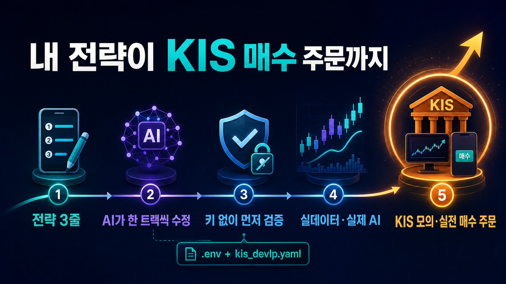
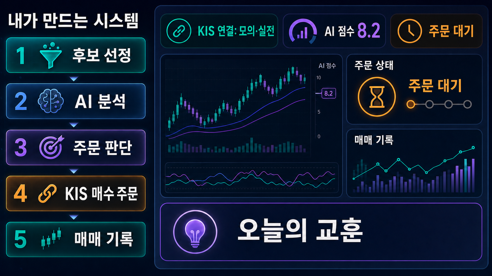
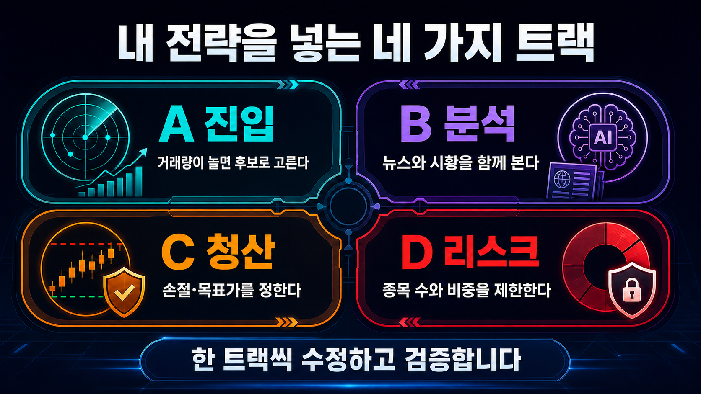
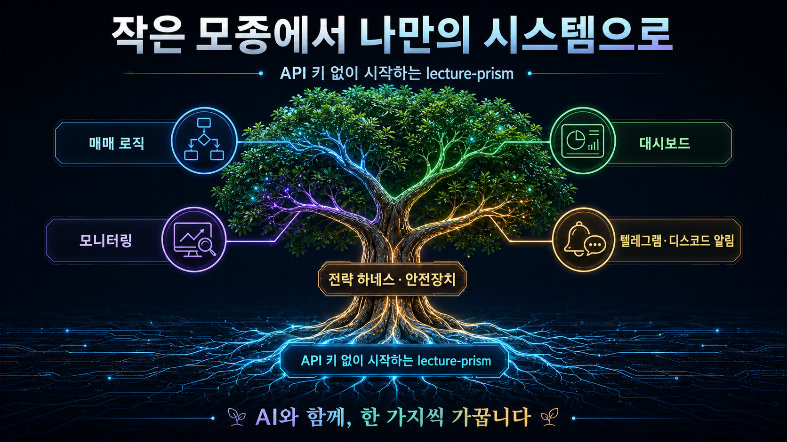

# lecture-prism

> 패스트캠퍼스 **「AI 네이티브 자동매매 시스템 구축」** 강의용 프로젝트입니다.
> 실제 운영 중인 오픈소스 [`prism-insight`](https://github.com/dragon1086/prism-insight)를 수업에서 직접 고쳐볼 수 있도록 작게 구성했습니다.

## 이 수업에서 만드는 것

이 수업에서는 **내 매매 전략 전체를 네 영역으로 나누고, 코딩 에이전트(Claude Code·Codex)와 함께 한 영역씩 코드로 옮깁니다.**

API 키 없이 먼저 전체 흐름을 실행하고, 같은 프로젝트에서 실데이터·실제 AI·상태형 paper 코어·선택 브로커까지 단계적으로 연결합니다. 완성된 비법을 복사하는 수업이 아니라, 내 생각을 작동하는 시스템으로 만드는 수업입니다.



## 수업에서는 이렇게 진행합니다

1. `MY_STRATEGY.md`에 내 매매 이론을 적습니다.
2. 코딩 에이전트가 전체 전략을 진입·분석·청산·리스크 네 영역으로 나눕니다.
3. 바꿀 순서를 정한 뒤, 가장 중요한 한 영역부터 코드에 반영합니다.
4. API 키 없이 기본 흐름을 실행해 수정 전후를 비교합니다.
5. 같은 과정을 다음 영역에 반복한 뒤, 실데이터·실제 AI·상태형 paper 또는 선택 브로커 경로로 확장합니다.

| 수업 | 무엇을 완성하나 |
|---|---|
| **파트 3** | 후보 선정 → 분석 → 주문 판단 → 매매 기록이 이어지는 전체 시스템을 실행하고, 상태 증거와 선택 연동을 구분해 봅니다. |
| **파트 4** | 내 전략을 네 영역으로 나누고, 우선순위가 높은 영역부터 하나씩 코드에 반영하고 검증합니다. |

코딩 경험이 없어도 괜찮습니다. 수강생은 전략과 성공 기준을 정하고, 설치·수정·실행·검증은 코딩 에이전트에게 맡깁니다.

## 내가 만드는 시스템은 이렇게 이어집니다



- **후보 선정**: 어떤 종목을 볼지 규칙으로 좁힙니다.
- **AI 분석**: 기술·뉴스의 정성 근거를 보되, 점수·목표가·손절가는 규칙이 소유합니다. LLM은 BUY를 HOLD로만 veto할 수 있습니다.
- **주문 판단**: 매수 여부와 수량을 정하고, 손절·목표가 조건을 적용합니다.
- **주문 수명주기**: KIS와 선택 Toss는 매수·매도·조회·취소·재시작 reconcile을 같은 안전 원칙으로 다룹니다. 응답이 불명확하면 `UNKNOWN`으로 멈추며, 실제 계좌 E2E를 뜻하지 않습니다.
- **매매 기록**: 판단·주문·체결 증거를 저장해 다음 전략 수정의 근거로 씁니다.
- **보조 운영**: 분석 배치·보유종목 감시·미체결 주문 확인·주간 메모리 압축을 본체와 나눠 실행합니다.

## 내 전략을 넣는 네 가지 트랙

하네스는 전체 전략을 네 영역으로 나눈 뒤, **수정 → 검증 → 전후 비교**를 한 영역씩 반복합니다. 여러 파일을 한꺼번에 바꾸지 않기 때문에 어디서 결과가 달라졌는지 확인하기 쉽습니다.

수업 시간에는 우선순위가 가장 높은 한 트랙을 끝까지 완주하면 성공입니다. 수업이 끝난 뒤에는 같은 방법으로 다음 영역을 이어서 반영할 수 있습니다.



| 트랙 | 내가 정하는 것 | 주로 바꾸는 파일 | 쉬운 예시 |
|---|---|---|---|
| **A · 진입** | 언제 종목을 살펴볼까 | `screening.py` | 거래량이 평소보다 크게 늘어난 종목만 고른다. |
| **B · 분석** | AI 분석가가 무엇을 중요하게 볼까 | `analysis_agents.py` | 기술·뉴스 등 한 역할의 질문을 바꾼다. |
| **C · 청산** | 언제 팔까 | `trading.py` | 손절·목표가·트레일링 스탑을 정한다. |
| **D · 리스크** | 얼마나 살까 | `trading.py` | 종목 수와 한 종목당 비중을 제한한다. |

가장 쉬운 시작은 코딩 에이전트에게 아래 문장을 그대로 붙여넣는 것입니다.

```text
MY_STRATEGY.md를 읽고 내 전략을 lecture-prism에 반영해줘.
진입·분석·청산·리스크 중 가장 가까운 한 트랙만 먼저 골라줘.
관련 파일 하나를 최소한으로 수정하고, API 키 없이 기본 데모를 끝까지 실행해줘.
수정 전후에 결과가 어떻게 달라졌는지 초보자도 이해하게 설명해줘.
검증이 끝나면 내 전략에 필요한 다음 영역과 추천 순서도 알려줘.
실제 주문은 내가 명확히 요청하고 설정하기 전까지 절대 하지 마.
```

A·C·D 트랙은 API 키 없이도 수정 전후 결과를 비교할 수 있습니다. B 트랙은 API 키 없이 코드 구조와 전체 실행을 먼저 확인하고, AI가 쓰는 실제 문장 변화는 LLM을 연결한 뒤 확인합니다.

## 두 가지 학습 경로

- **기본 학습 경로**: `mock`과 `real_data`에서 `screening.py` → `analysis_agents.py`·`analysis.py` → `buy_agent.py` → `trading.py` → `feedback.py`를 실행합니다. API 키 없는 첫 성공과 A/B/C/D 전략 수정은 여기서 시작합니다.
- **상태 기반 고급 경로**: `classroom`·`backtest`·`paper`·`live`는 `prism_core`의 시장 국면, 주문 원장, 체결·청산 증거를 사용합니다. `classroom`은 고정 offline 재생이고, `paper/live`는 market provider 오류를 mock 매매로 바꾸지 않고 fail-closed로 멈춥니다.

## 수업이 끝나면 남는 것

- **내 전략이 반영된 코드**: 말로만 설명하던 이론이 실제 실행 규칙으로 남습니다.
- **API 키 없이 돌아가는 기본 시스템**: 별도 설정이 없어도 후보 선정부터 분석·주문 판단·기록까지 완주합니다.
- **수정 전후 결과 비교**: 무엇을 바꿨고 결과가 왜 달라졌는지 확인할 수 있습니다.
- **작은 운영 도구**: `operations.py`로 분석 배치·보유종목 감시·주문 대사·메모리 압축을 각각 안전하게 연습합니다.
- **상태·브로커까지 이어지는 같은 프로젝트**: 안내에 따라 classroom 증거를 재생하고, `.env`와 `trading/trading/config/kis_devlp.yaml`으로 KIS 모의투자·KIS 실전투자 설정을 구분할 수 있습니다. KIS 또는 선택 Toss의 매수·매도·조회·취소·재시작 reconcile 구현은 읽기 전용 fixture 검증으로 먼저 확인합니다.

모의투자는 브로커 연결 허용 설정이 필요합니다. 실계좌 주문은 실수로 실행되지 않도록 기본 차단되어 있으며, 실전 모드에서는 두 안전장치를 사용자가 직접 해제해야 합니다. 정확한 준비 순서는 [`docs/runtime-profiles.md`](docs/runtime-profiles.md)에서 확인합니다.

## 수업 뒤에는 직접 키워 갑니다

제가 드리는 `lecture-prism`은 완성된 나무가 아니라 **작은 나무 모종**에 가깝습니다. `prism-insight`도 작은 코드에서 출발해 운영 중에 발견한 문제를 하나씩 고치며 지금의 모습으로 자랐습니다.



그림의 가지들은 수업 직후 모두 완성된 기능이 아니라, 집에서 AI와 함께 하나씩 붙여 갈 수 있는 확장 방향입니다.

여러분도 집에서 AI와 함께 매매 로직을 다듬고, 모니터링과 대시보드를 보기 좋게 가꾸고, 기본 Discord 판단 알림의 문구와 채널을 더 쓸모 있게 만들 수 있습니다. 한꺼번에 크게 바꾸기보다 한 가지를 고치고 확인하는 일을 반복하다 보면, 이 모종은 점점 안정적인 나만의 시스템으로 자라납니다.

## 어디서 시작하면 되나요?

- **처음 실행하기**: [`START_HERE.md`](START_HERE.md)
- **파트 3 실습**: [`lecture/exercises/수강생_붙여넣기_프롬프트_파트3.md`](lecture/exercises/수강생_붙여넣기_프롬프트_파트3.md)
- **파트 4 전략 실습**: [`lecture/exercises/수강생_붙여넣기_프롬프트_파트4.md`](lecture/exercises/수강생_붙여넣기_프롬프트_파트4.md)
- **API 키와 구독 연결**: [`docs/api-keys.md`](docs/api-keys.md)
- **런타임 프로필과 KIS·Toss 안전 설정**: [`docs/runtime-profiles.md`](docs/runtime-profiles.md)
- **증권사 어댑터 구조**: [`docs/broker-adapters.md`](docs/broker-adapters.md)
- **현재 아키텍처와 원본 PRISM 참고 자료**: [`docs/architecture.md`](docs/architecture.md)

> 이 프로젝트의 기본값은 학습과 검증을 위한 안전 모드입니다. 투자 판단과 실계좌 운영의 책임은 사용자에게 있습니다.
