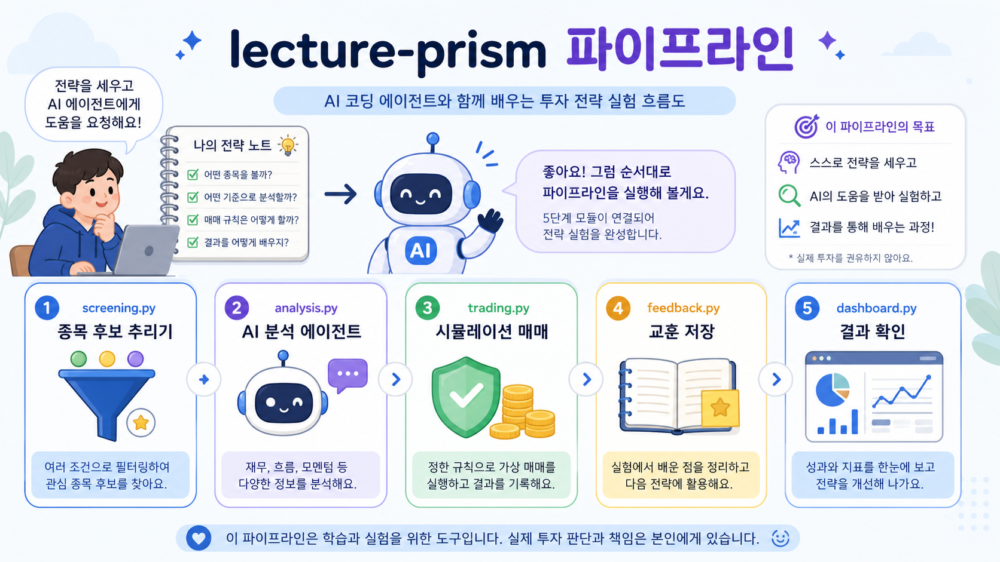

# lecture-prism 아키텍처 그림 모음

이 문서는 코드를 처음 보는 수강생이 “어느 파일이 어떤 역할을 하는지” 먼저 잡을 수 있도록 만든 그림 설명입니다.

## 1. 전체 파이프라인

전체 흐름은 아래처럼 이해하면 됩니다.

| 단계 | 파일 | 쉬운 비유 | 결과 |
|---|---|---|---|
| 1 | `screening.py` | 넓은 시장에서 볼 종목을 줄이는 체 | 후보 종목 리스트 |
| 2 | `analysis.py` | 후보를 여러 관점에서 읽는 AI 분석팀 | 추천, 점수, 근거, 리스크 |
| 3 | `trading.py` | 살지 말지, 얼마나 살지 정하는 매매 규칙 | 시뮬레이션 체결 결과 |
| 4 | `feedback.py` | 매매일지를 쓰고 교훈을 뽑는 회고 담당 | 다음 판단에 쓸 교훈 |
| 5 | `dashboard.py` | 결과를 눈으로 보는 화면 | 웹 대시보드 |

## 2. 분석 에이전트 파이프라인

`analysis.py`는 한 번에 “AI 하나에게 다 물어보는” 구조가 아닙니다.

1. 기술적 분석 에이전트가 차트·거래량 관점으로 요약합니다.
2. 뉴스 분석 에이전트가 호재·악재 관점으로 요약합니다.
3. 투자전략 에이전트가 앞의 두 결과를 합쳐 `BUY`, `HOLD`, `PASS` 중 하나를 고릅니다.

LLM 연결이 없으면 mock 응답으로 동작합니다. 그래서 수업 초반에는 API 키가 없어도 전체 흐름을 먼저 볼 수 있습니다.

실제 LLM을 연결할 때는 원본 PRISM-INSIGHT와 같은 방향으로 `cores/chatgpt_proxy`의 내장 OAuth 프록시를 사용합니다. 수강생은 프록시를 새로 구현하지 않고, 코딩 에이전트에게 “내장 프록시로 로그인·실행·검증해줘”라고 지시하면 됩니다.

## 3. 피드백 루프

자동매매에서 중요한 것은 “한 번 맞히기”가 아니라 “다음 판단이 조금 더 나아지게 만들기”입니다.

- `feedback.py`는 매매 결과를 보고 교훈을 만듭니다.
- `db.py`는 그 교훈을 `prism.db`에 저장합니다.
- `dashboard.py`는 교훈을 화면에 보여줍니다.
- 수강생은 그 교훈을 보고 다음 전략·프롬프트를 고칩니다.

## 4. 수강생 실습 흐름

처음에는 전체 시스템을 다 이해하려 하지 말고, 아래 중 하나만 바꾸면 됩니다.

- 진입 조건을 바꾸고 싶다 → `screening.py`
- AI가 보는 관점을 바꾸고 싶다 → `analysis.py`
- 언제 팔지 바꾸고 싶다 → `trading.py`의 `_decide_exit`
- 얼마나 보수적으로 운용할지 바꾸고 싶다 → `trading.py`의 리스크 상수

## 5. PRISM 본 시스템과의 관계

lecture-prism은 PRISM 본 시스템의 축소판입니다.

| 본 시스템에서 배우는 개념 | lecture-prism에서 보는 위치 |
|---|---|
| 많은 데이터 중 후보만 추리기 | `screening.py` |
| 여러 AI 에이전트를 순서대로 연결하기 | `analysis.py` |
| ChatGPT 구독으로 API 키 없이 LLM 쓰기 | `cores/chatgpt_proxy/`, `analysis.py` |
| 주문 전 리스크 판단하기 | `trading.py` |
| 매매일지와 장기 기억 만들기 | `feedback.py`, `db.py` |
| 사람이 결과를 보고 다음 개선 방향 잡기 | `dashboard.py`, 실습 프롬프트 |

강의에서는 “처음부터 완벽한 자동매매”보다, 본인의 전략을 작은 코드 변경으로 반영하고 검증하는 감각을 먼저 익힙니다.
