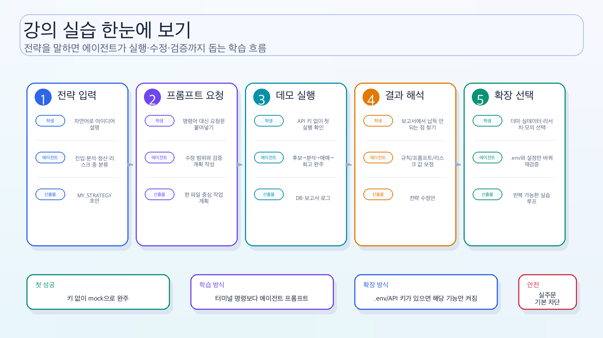
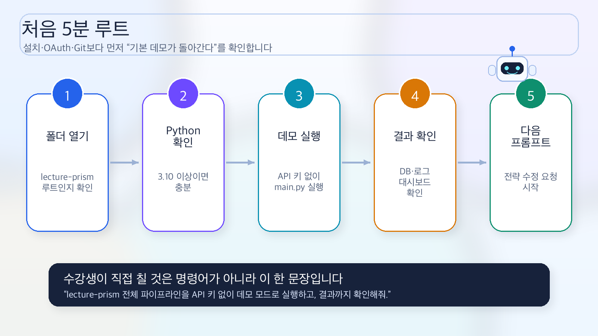
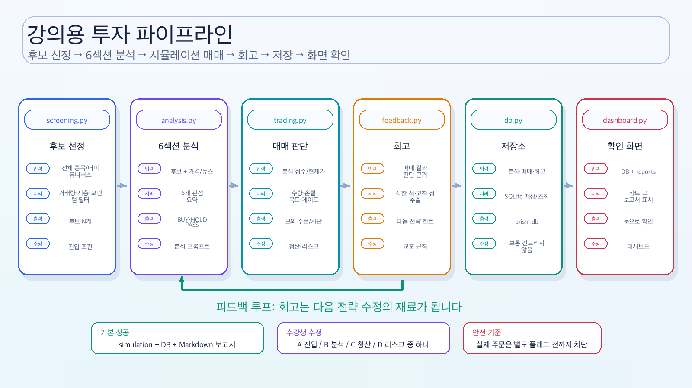
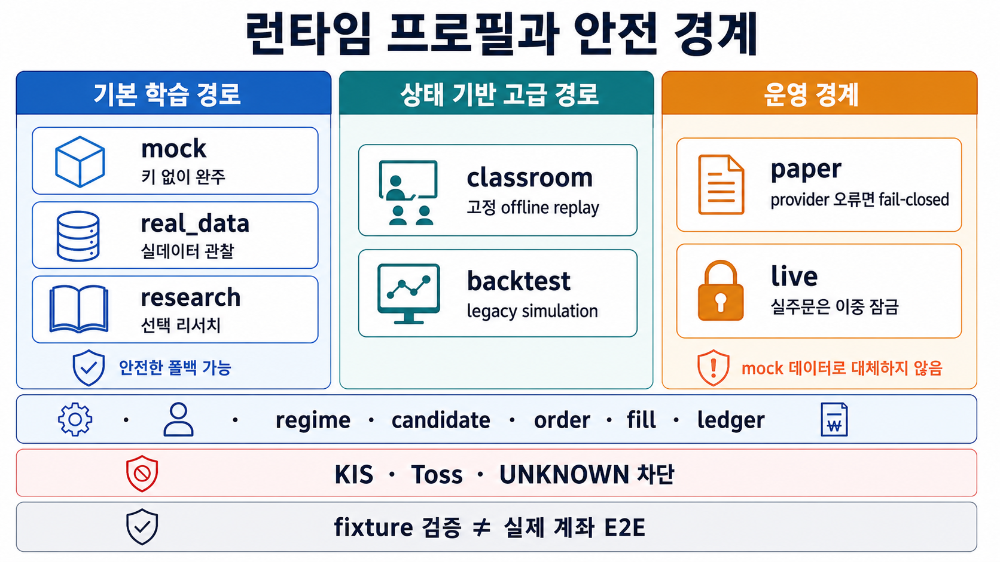
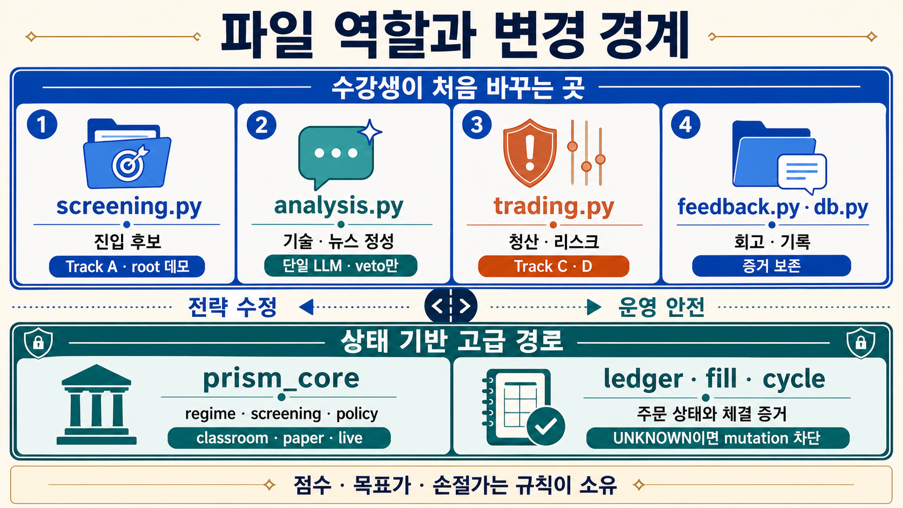
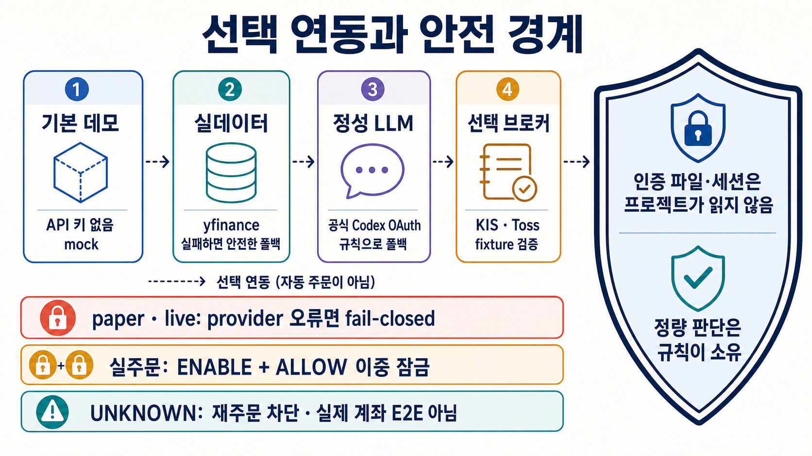
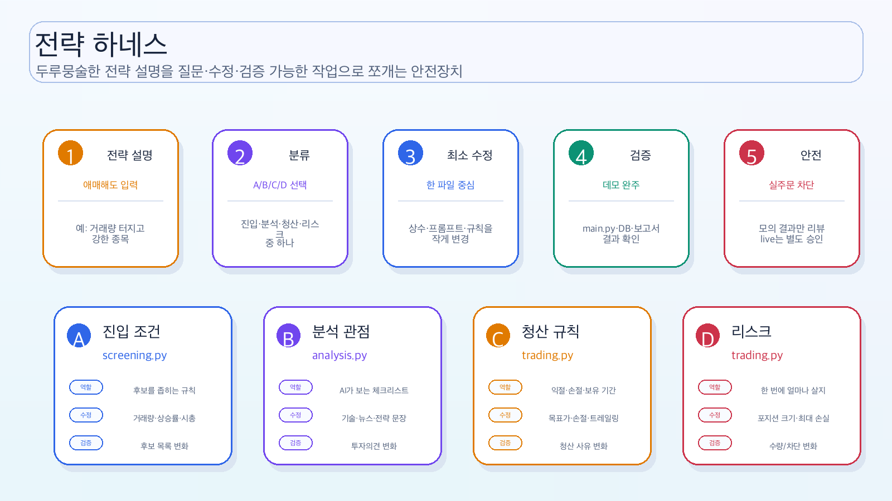
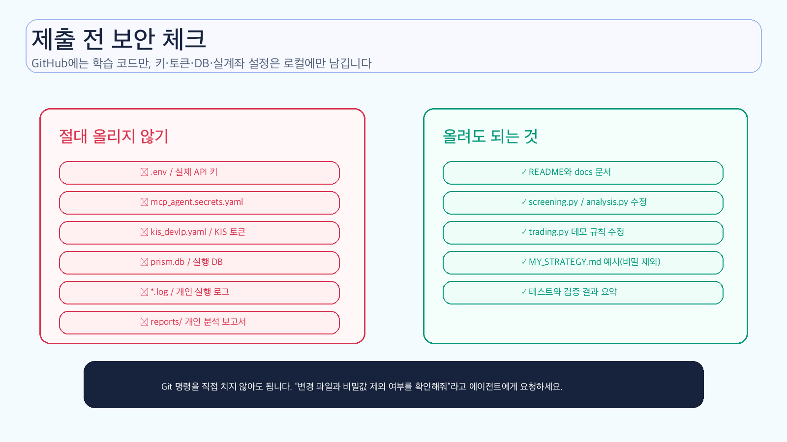

# lecture-prism 아키텍처 그림 모음

이 문서는 코드를 처음 보는 수강생이 “어느 파일이 어떤 역할을 하는지” 먼저 잡을 수 있도록 만든 그림 설명입니다. README와 같은 한글 PNG 그림을 사용하므로 SVG/Mermaid 다이어그램을 읽지 않아도 흐름을 볼 수 있습니다.

현재 강의 코드는 두 실행 경로를 함께 갖습니다.

- **기본 학습 경로**는 `mock`/`real_data`의 루트 4단계 파이프라인입니다. API 키 없는 첫 성공과 한 파일 중심의 전략 수정을 위한 경로입니다.
- **상태 기반 고급 경로**는 `classroom`/`backtest`/`paper`/`live`와 `prism_core`의 regime·candidate·order·fill·ledger 계약입니다. `classroom`은 고정 offline 재생이고, `paper/live`는 provider 오류에서 fail-closed로 멈춥니다.

## 1. 전체 학습 지도

이 강의 저장소는 “내 전략을 말한다 → 코딩 에이전트가 실행·수정한다 → 데모 모드로 확인한다 → 보고서와 대시보드로 본다”는 흐름을 연습하는 공간입니다.

## 2. 처음 5분 루트

처음에는 설치·OAuth·Git을 한꺼번에 해결하지 않습니다. 가장 먼저 볼 것은 **API 키 없이 기본 데모가 실행되는지**입니다.

## 3. 기본 학습 경로 — 강의용 투자 파이프라인

| 단계 | 파일 | 쉬운 비유 | 결과 |
|---|---|---|---|
| 1 | `screening.py` | 넓은 시장에서 볼 종목을 줄이는 체 | 후보 종목 리스트 |
| 2 | `analysis_agents.py`, `analysis.py` | 여섯 전문 보고서 에이전트 + 편집 에이전트 | 6섹션 보고서와 핵심 요약 |
| 3 | `buy_agent.py`, `trading.py` | 보고서를 읽는 매수 에이전트 + 코드 안전 게이트 | Enter/No Entry, 점수·가격, 수량·주문 |
| 3 | `trading.py` | 기존 보유분의 청산을 먼저 보고, 신규 진입 여부와 수량을 정하는 매매 규칙 | SELL/BUY simulation 결과 또는 안전한 broker handoff |
| 4 | `feedback.py` | 매매일지를 쓰고 교훈을 뽑는 회고 담당 | 다음 판단에 쓸 교훈 |
| 5 | `dashboard.py` | 결과를 눈으로 보는 화면 | 웹 대시보드 |
| 보조 | `operations.py` | 분석 배치·보유종목 감시·주문 대사·메모리 압축을 한 번씩 실행 | 반복 운영 작업 |
| 보조 | `memory.py` | 교훈을 단기·중기·장기로 옮기고 장기 기억 수를 제한 | 다음 판단에 넣을 압축 기억 |
| 선택 | `notifications.py` | 각 단계의 AI 판단과 근거를 Discord에 전달 | 스크리닝·종목별 분석·매매 판단·AI 판단 요약 |
| 선택 | `kis_market_data.py` | KIS에서 가격과 일별 투자자 수급만 읽는 창구 | 기준일·가격·기관·외국인·개인 순매수 |

LLM 연결이 없으면 각 보고서 에이전트가 규칙 기반 작성기로 폴백합니다. 연결하면 여섯 전문 에이전트가 개별 호출되고 편집 에이전트가 마지막에 보고서를 요약합니다. 매수 판단은 별도 `buy_agent.py`가 맡으며 추천·점수·목표가·손절가는 규칙이 소유하고 LLM은 BUY를 HOLD로만 veto할 수 있습니다. `trading.py`는 가격 배열·손익비·포지션 한도를 다시 검사합니다.

`trading.py`는 `trade_history`에서 종목별 최신 BUY 상태를 읽고, 실행할 때마다 매수 이후 최고가를 갱신한 뒤 손절 → 트레일링 스탑 → 목표가 순으로 청산을 먼저 검사합니다. 이미 보유 중인 종목과 같은 실행에서 매도 판단이 난 종목은 다시 사지 않습니다. 이후에만 신규 진입을 봅니다.

`operations.py`는 한 번의 메인 실행 밖에서 필요한 작은 운영 작업을 보여 줍니다. 평일 분석 배치, 보유종목 청산 점검, 미체결 주문 조회, 주간 메모리 압축을 서로 독립적으로 실행합니다. 기본 시간표도 들어 있지만 `LECTURE_ENABLE_SCHEDULER=1`을 명시하지 않으면 예약 루프는 시작되지 않습니다. 보유종목 감시는 항상 simulation 체결로 `feedback.py`에 돌아오며, 주문 대사는 상태를 조회할 뿐 새 주문을 만들지 않습니다.

`feedback.py`는 BUY 직후의 열린 거래를 결과 교훈으로 꾸며 내지 않습니다. SELL로 결과가 닫힌 뒤에만 판단 교훈을 남깁니다. `memory.py`는 7일이 지난 단기 기억을 중기로 옮기고, 30일이 지난 중기 기억 가운데 같은 교훈이 두 번 이상 반복될 때만 장기 원칙을 만듭니다. 활성 장기 기억은 기본 20건으로 제한하며, `trading.py`는 같은 종목의 최근 기억과 범용 장기 원칙을 합쳐 최대 5건만 읽습니다.

Discord 알림은 기본값이 꺼져 있습니다. `LECTURE_NOTIFY_DISCORD=1`과 유효한 `DISCORD_WEBHOOK_URL`을 함께 설정하면 `main.py`가 단계가 끝날 때마다 `notifications.py`를 호출합니다. 메시지에는 계좌 잔고나 계좌번호가 아니라 후보·분석 근거·BUY/SELL/HOLD/PASS 판단과 피드백 저장 결과만 들어갑니다. Discord가 실패해도 매매 판단과 DB 저장은 계속됩니다.

## 4. 옵션별 전체 아키텍처

`.env`의 프로필 하나가 더미 데이터, 실데이터, LLM, Perplexity/Firecrawl, 브로커 모의투자, 실전투자 잠금까지 어느 깊이로 켤지 결정합니다. 키나 패키지가 없을 때 안전하게 건너뛰거나 mock으로 돌아가는 설명은 `mock`/`real_data` 관찰 경로와 LLM·리서치 같은 **선택 분석 연동**에만 해당합니다. `paper/live`는 실시세 market provider 검증이 실패하면 mock으로 돌아가지 않고 **fail-closed**로 진입을 막습니다.

## 5. 파일별 역할 지도

처음부터 전체 코드를 다 읽을 필요는 없습니다.

- 진입 조건을 바꾸고 싶다 → `screening.py`
- AI 분석가의 관점과 프롬프트를 바꾸고 싶다 → `analysis_agents.py`
- 보고서를 읽는 매수 판단을 바꾸고 싶다 → `buy_agent.py`
- 진입 전에 무엇을 다시 확인하고, 언제 판단을 무효로 볼지 보고서에 적고 싶다 → `report_writer.py`
- 실제 진입의 가격 배열·손익비 기준을 바꾸고 싶다 → `trading.py`
- 언제 팔지 바꾸고 싶다 → `trading.py`의 `_decide_exit`
- 얼마나 보수적으로 운용할지 바꾸고 싶다 → `trading.py`의 리스크 상수
- 결과를 보고 싶다 → `dashboard.py`
- 보유종목 점검·주문 대사·예약 작업을 보고 싶다 → `operations.py`
- 교훈 승격·압축 기준을 바꾸고 싶다 → `memory.py`

## 6. API 키와 선택 연동

강의 기본 실습에는 필수 API 키가 없습니다. 실제 LLM은 공식 Codex의 ChatGPT 구독 로그인 또는 별도 OpenAI API 키로 선택 연결합니다. KIS를 준비한 수강생은 Part 3 말미와 Part 4에서 가격·일별 투자자 수급만 읽기 전용으로 보강할 수 있습니다. 이때 `data_source.py`는 yfinance 기반의 다른 자료를 그대로 두고 수급 섹션의 거래량 프록시만 KIS 기관·외국인·개인 순매수로 바꿉니다. 주문·계좌 경로는 별도 심화 범위이며 `trading.py`는 실거래 요청을 기본으로 차단합니다.

## 7. 전략 하네스

수강생이 전략을 두루뭉술하게 말해도, 코딩 에이전트가 진입·분석·청산·리스크 중 어디를 바꿀지 정리하고 가장 안전한 한 파일부터 수정·검증하도록 돕습니다.

## 8. 제출 전 보안 체크

GitHub에 올려야 하는 것은 학습 코드와 문서입니다. 실제 API 키, OAuth 토큰, KIS 설정, DB 파일, 로그 파일은 로컬에만 남겨야 합니다.

## 9. 본 시스템과의 관계

lecture-prism은 PRISM 본 시스템의 축소판입니다. 아래 링크와 `docs/assets/prism-insight/` 그림은 **원본 PRISM의 참고 아키텍처**이며, 현재 lecture-prism의 실행 경로를 그대로 설명하지는 않습니다.

| 본 시스템에서 배우는 개념 | lecture-prism에서 보는 위치 |
|---|---|
| 많은 데이터 중 후보만 추리기 | root `screening.py`, 고급 경로의 `prism_core/screening.py` |
| 여러 AI 에이전트를 연결하기 | `analysis_agents.py`의 독립 전문 에이전트 6개와 편집 에이전트 |
| 공식 Codex 구독 또는 API 키로 실제 LLM 붙이기 | `llm_provider.py`, `analysis.py` |
| 주문 전 리스크 판단하기 | `trading.py` |
| 매매일지와 장기 기억 만들기 | `feedback.py`, `memory.py`, `db.py` |
| 분석 배치·보유종목 감시·주문 대사 | `operations.py` |
| 사람이 결과를 보고 다음 개선 방향 잡기 | `dashboard.py`, 실습 프롬프트 |

강의에서는 “처음부터 완벽한 자동매매”보다, 본인의 전략을 작은 코드 변경으로 반영하고 검증하는 감각을 먼저 익힙니다.

원본 시스템의 실제 실행 순서와 세부 매매 로직까지 보려면 다음 문서를 이어서 읽으세요.

- [`run_full_pipeline` 전체 아키텍처](prism-insight/run-full-pipeline-architecture.md)
- [원본 매매·시황·비중 제어 구조](prism-insight/trading-and-regime-architecture.md)
- [원본 구조 기반 강의 질문 은행](prism-insight/lecture-question-bank.md)

## 10. 지금 연결된 상태형 paper 코어

기본 `mock`은 처음 성공을 위한 기존 경로입니다. API 키 없이 `screening.py` → `analysis.py` → `trading.py` → `feedback.py`를 지나며, 기존 강의용 테이블에 분석·매매·교훈을 남깁니다. 반면 `classroom`은 같은 기본 데모의 별칭이 아니라, `prism_core/`를 실제로 호출하는 **고정 offline 상태 재생**입니다. 삼성전자(KR)와 AAPL(US)을 진입하고, 고점을 갱신한 다음, 트레일링 스탑으로 청산하는 세 사이클을 재현합니다.

| 구성요소 | 현재 구현된 역할 |
|---|---|
| `prism_core/domain.py` | 주문 상태와 시장별 계약을 정의합니다. KR은 KRW, US는 USD이며 한국 주식 수량은 정수여야 합니다. |
| `prism_core/paper_broker.py` | 주문을 `CREATED` → `PREVIEWED` → `SUBMITTED` → `ACCEPTED`로 진행합니다. `ACCEPTED`만으로는 포지션을 만들지 않고, 별도의 fill이 기록되어야 체결됩니다. |
| `prism_core/ledger.py` | SQLite에 주문 이벤트, fills, positions, realized trades, classroom replay 상태를 저장합니다. 프로세스를 재시작해도 이어지며, 청산 거래에는 주문·fill provenance를 함께 남깁니다. |
| `prism_core/cycle.py` | 포트폴리오 전체를 관찰해 **유효한 유한 quote가 있는 모든 포지션**의 high-water를 청산 write 전에 먼저 저장합니다. quote가 없거나 잘못된 포지션은 건너뛰고 주문 mutation을 만들지 않은 뒤, 청산 판단과 주문을 새 진입보다 먼저 처리합니다. 즉 **청산 우선**입니다. |
| `prism_core/classroom.py` | KR/US 진입 → 고점 갱신 → 트레일링 청산을 결정론적으로 실행하고, 중단된 세션은 SQLite 증거에 맞춰 재개합니다. |
| `prism_core/regime.py` | KR 120/60 이동평균, US 200/50 이동평균과 VIX를 구분해 `strong_bull`부터 `strong_bear`까지 5단계를 계산합니다. |
| `prism_core/screening.py`, `policy.py` | trigger plugin을 점수화하고 regime별 최소 점수·손익비·손절폭·위험률을 같은 코드 정책으로 강제합니다. |
| `prism_core/market_pipeline.py` | provider validation → regime → screening → analysis gate → sizing → cycle 순서로 진입 증거를 연결합니다. |

시황과 스크리닝은 따로 평가하지 않습니다. 같은 후보라도 bull의 완화된 점수·손익비 문턱에서는 통과하고, bear의 높은 문턱과 비활성 trigger에서는 거절됩니다. 이 차이를 없애면 regime을 계산해도 실제 진입 안전에 쓰지 못합니다.

과거 구간은 각 판단 시점까지의 데이터만 보는 walk-forward로 분리합니다. 미래 데이터를 진입 판단에 섞지 않아야 하며, 종목 목록도 첫 판단일에 이미 알 수 있었던 **point-in-time universe snapshot**이어야 합니다. 마지막 날짜에 조회한 현재 구성 종목을 과거 전체에 소급하면 survivorship bias가 생기므로 엔진은 이를 빈 결과로 숨기지 않고 중단합니다. 결과는 전략과 regime 궁합을 비교하는 교육용 증거일 뿐 **수익 보장 아님**을 명시합니다.

`UNKNOWN` 주문은 성공이나 실패를 추측하지 않습니다. 해당 종목의 새 주문이나 replay 주문, fill, 청산 mutation을 막고, 명시적인 관찰 증거에 근거한 reconciliation이 끝날 때까지 fail-closed로 유지합니다. 다만 사이클 앞단의 관찰과 mutation은 구분됩니다. 유효한 quote가 있다면 UNKNOWN 주문이 있어도 포지션의 high-water 관찰은 먼저 저장될 수 있습니다. 이 규칙은 네트워크 응답을 잃어버렸을 때 같은 주문을 두 번 내는 문제를 피하기 위한 안전장치입니다.

## 11. 완료 증거와 남은 연결 범위

완료와 미완료를 같은 기준으로 구분합니다.

- 완료 — 공식 Codex 구독으로 전문 보고서 에이전트 6개와 편집 에이전트 개별 호출, 섹션별 규칙 폴백
- 완료 — KIS 매수·매도, 주문가능수량·보유수량 제한, 체결 조회, 취소, 재시작 reconcile, UNKNOWN 중복주문 차단
- 남은 선택 확장 — KIS 정정은 취소 후 재주문으로 처리하며 별도 정정 API 명령은 제공하지 않음
- 완료 — Toss WTS 선택 어댑터의 매수·매도, 수량 제한, 체결 조회, 취소, 재시작 reconcile, 인증 만료·UNKNOWN 차단 fixture 검증
- 미완료 — `dashboard.py`에서 `broker_orders`, `order_events`, `fills`, `positions`, `realized_trades`, `classroom_replays`를 직접 시각화하는 화면

현재 대시보드는 기존 `trade_history`, `analysis_decisions`, `feedback_lessons`만 읽으며 **core table 시각화는 미완료**입니다. 따라서 classroom 실행 증거는 SQLite 조회로 확인해야 하며, 대시보드에 core table이 보인다고 설명하면 안 됩니다. OAuth는 공식 Codex 경로로 연결됐지만, LLM 서술은 진입 정량 게이트를 우회할 수 없습니다. Toss는 비공식 WTS 선택 경로이며 fixture 수명주기만 검증됐고 실제 계좌 E2E 완료를 뜻하지 않습니다.
