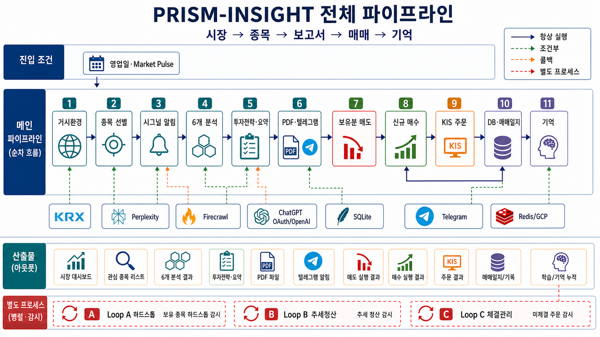
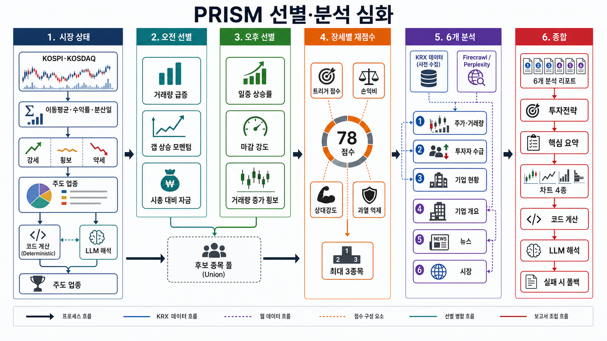
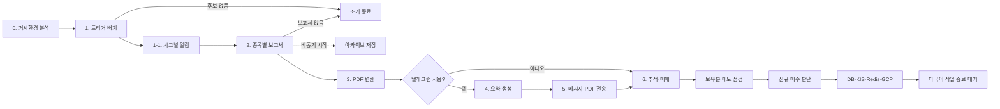

# PRISM 원본 `run_full_pipeline` 전체 아키텍처

이 문서는 원본 [`prism-insight`](https://github.com/dragon1086/prism-insight)의 한국 주식 배치를 코드 기준으로 복원한 해설서입니다. 분석 기준은 `main` 브랜치의 커밋 `3c4a675b5fa1578cb445fbedfffe3cb49121f177`이며, 시작점은 `stock_analysis_orchestrator.py`의 `StockAnalysisOrchestrator.run_full_pipeline()`입니다.

문서의 목적은 두 가지입니다.

- 강사가 시스템의 세부 구조를 다시 파악할 때 쓰는 기준 문서
- 수강생이 “내 전략은 어디에 넣어야 하나?”를 판단할 때 보는 원본 지도

원본 코드를 실행하지 않고 호출 경로, 설정, 테스트, 운영 문서를 함께 대조했습니다. 실제 서버의 `.env`, 계좌 설정, DB 내용은 확인하지 않았으므로 “운영 서버에서 지금 켜져 있는가”까지는 단정하지 않습니다.

## 한눈에 보는 전체 구조





두 번째 그림 가운데의 숫자 원판은 네 가지 재점수 요소가 합쳐진다는 뜻을 보여주는 예시입니다. 원본의 실제 최종 점수 척도는 0~1이고, 이후 매수 판단의 `buy_score`는 1~10이라서 원판 숫자 자체를 실제 기준으로 읽으면 안 됩니다.

PRISM 원본은 단순히 “AI가 종목을 추천하는 프로그램”이 아닙니다. 실제 흐름은 다음과 같습니다.

```text
영업일·시장상태 확인
  → 시장 전체 상태 계산
  → 오전/오후 후보 종목 선별
  → 종목별 6개 분석
  → 투자전략과 요약 생성
  → Markdown·PDF·텔레그램 배포
  → 기존 보유분 매도 점검
  → 신규 매수 판단과 KIS 주문
  → 결과 저장·알림·매매일지
```

lecture-prism의 `screening.py → analysis.py → trading.py → feedback.py → db.py`와 큰 방향은 같습니다. 원본은 각 상자를 다시 여러 단계로 쪼개고, 장세 판단·실데이터·텔레그램·KIS·매매일지·운영 배치를 붙인 형태입니다.

## 읽기 전에 알아둘 말

| 표현 | 이 문서에서의 뜻 |
|---|---|
| 시장 체제, 레짐 | 강세·횡보·약세처럼 현재 시장 상태를 나눈 값 |
| 탑다운 | 시장과 주도 업종을 먼저 보고 그 안에서 종목을 고르는 방식 |
| 바텀업 | 개별 종목의 가격·거래량·재무를 먼저 보고 고르는 방식 |
| 폴백 | 앞 단계가 실패했을 때 더 단순한 대체 방법으로 계속하는 처리 |
| 피라미딩 | 이미 수익 중인 같은 종목을 한 슬롯 더 사는 추가 진입 |
| shadow | 판단과 로그만 남기고 실제 동작은 바꾸지 않는 시험 모드 |
| live | 판단이 실제 배치 중단이나 주문에 영향을 주는 모드 |

## 1. 실행 진입점

`run_full_pipeline()`만 직접 호출하는 경우와 파일을 CLI로 실행하는 경우는 다릅니다. CLI에는 파이프라인 앞쪽의 안전·운영 장치가 더 있습니다.

| 순서 | CLI `main()`에서 하는 일 | 실패하거나 조건이 안 맞으면 |
|---|---|---|
| 1 | 오늘이 영업일인지 확인 | 휴장일이면 정상 종료 |
| 2 | 120분 강제 종료 타이머 시작 | 장기 정지 방지 |
| 3 | Market Pulse로 배치를 쉴지 판단 | 기본 `shadow`면 로그만 남기고 계속 |
| 4 | 텔레그램 설정 생성·검증 | 텔레그램 사용 중인데 설정이 없으면 시작 중단 |
| 5 | ChatGPT OAuth 프록시 선택 실행 | 실패하면 표준 OpenAI API 경로로 돌아감 |
| 6 | `morning`, `afternoon`, 또는 둘 다 실행 | 선택한 모드만 호출 |

근거: `stock_analysis_orchestrator.py:1283-1422`, `cores/regime_policy.py:90-147`.

### Market Pulse는 시장 체제 계산과 다른 장치입니다

두 기능을 구분해야 합니다.

- **Market Pulse**: 배치 자체를 실행할지 쉽니다. `CORRECTION`에서 KR 오전 배치를 쉬고 오후 배치를 남기는 정책입니다. 기본은 `shadow`입니다.
- **시장 체제 계산**: 배치를 실행한 뒤 종목 점수, 탑다운 슬롯, 매수 문턱, 최대 보유 수에 쓰는 `strong_bull` 같은 값입니다.

`run_full_pipeline()`을 Python 코드에서 직접 호출하면 Market Pulse 게이트는 거치지 않습니다. 또 CLI 기본값인 `--mode both`는 정책표의 `morning`이나 `afternoon`과 일치하지 않아, `CORRECTION + live`에서도 두 배치를 모두 실행한 뒤 내부에서 각각 호출합니다. 강의에서 “배치를 쉰다”고 설명할 때 이 차이를 함께 말해야 합니다.

## 2. `run_full_pipeline()`의 실제 순서



| 단계 | 입력 | 핵심 처리 | 출력 | 실패 동작 |
|---|---|---|---|---|
| 0. 거시환경 | 기준일, 언어 | KOSPI·KOSDAQ 계산 + LLM 정성 분석 | `macro_context` | 전부 실패하면 `None`으로 계속 |
| 1. 선별 | 모드, `macro_context` | 오전/오후 트리거, 재점수, 최대 3종목 | 종목 목록, JSON | 후보가 없으면 종료 |
| 1-1. 시그널 | 선별 JSON | 사람용 텔레그램 메시지 생성 | 즉시 알림 | 실패해도 보고서 생성 계속 |
| 2. 보고서 | 종목, 거시환경 | 6개 섹션, 투자전략, 요약, 차트 | `reports/*.md` | 종목 하나가 실패하면 다음 종목 계속 |
| 2-1. 아카이브 | Markdown 경로 | 검색용 아카이브 적재 | `archive.db` | 기다리지 않고 시작만 함 |
| 3. PDF | Markdown | Playwright 렌더링 | `pdf_reports/*.pdf` | 파일별 실패 후 다음 파일 계속 |
| 4. 텔레그램 요약 | PDF | PDF를 읽어 짧은 메시지 생성 | `telegram_messages/*.txt` | 파일별 실패 후 계속 |
| 5. 전송 | 메시지, PDF | 본 채널·다국어 채널·인사이트 이미지 | 텔레그램 게시물 | 채널별 실패를 기록하고 계속 |
| 6. 추적·매매 | PDF, 트리거 JSON | 기존 보유분 점검 후 신규 진입 판단 | DB, 주문, 알림 | tracking 전체 예외를 기록하고 파이프라인 종료 |

근거: `stock_analysis_orchestrator.py:1065-1281`.

### 직렬과 병렬

- 종목 여러 개는 기본적으로 **한 종목씩 직렬 처리**합니다. OpenAI 호출 제한을 피하려는 선택입니다.
- 종목 하나 안의 6개 분석도 기본은 직렬입니다.
- `PRISM_PARALLEL_REPORT=true`일 때만 6개 섹션을 각각 별도 `MCPApp`으로 병렬 실행합니다.
- 다국어 메시지는 언어별 병렬로 만들지만, 번역 PDF는 메모리를 아끼려고 언어별·파일별로 순차 처리합니다.
- `generate_reports(..., timeout=600)`의 `timeout` 값은 현재 함수 안에서 사용하지 않습니다. 이름과 달리 종목별 10분 제한이 걸리지 않습니다.

## 3. 시장 전체 상태를 만드는 법

거시환경은 “코드 계산”과 “LLM 해석”을 합칩니다.

### 3.1 코드가 먼저 계산하는 부분

`prefetch_macro_intelligence_data()`가 다음 자료를 모읍니다.

- KOSPI·KOSDAQ 지수 OHLCV
- 종목코드와 KRX 업종 매핑
- 20일·60일·120일 이동평균
- 최근 2주 수익률
- 60일선과 120일선의 배열
- 최근 분산일 수
- 급락과 고변동이 겹치는지 여부

기본 시장 체제는 다섯 단계입니다.

| 시장 체제 | 쉬운 뜻 |
|---|---|
| `strong_bull` | 지수가 이동평균 위에서 강하게 오름 |
| `moderate_bull` | 상승 흐름이지만 폭발적이지 않음 |
| `sideways` | 방향이 섞인 횡보 |
| `moderate_bear` | 약한 하락 흐름 |
| `strong_bear` | 이동평균 아래에서 강하게 하락 |

`REGIME_HIVOL_OVERRIDE`는 급락·고변동장에서 강세로 잘못 읽는 경우를 막습니다. 기본 `shadow`는 강등 가능성만 기록하고, `active`일 때 실제로 `sideways`로 낮춥니다.

근거: `cores/data_prefetch.py:175-246`, `cores/data_prefetch.py:395-574`.

### 3.2 LLM이 보태는 부분

거시 에이전트는 계산된 지수 요약을 받은 뒤 Perplexity를 이용해 다음 내용을 JSON으로 냅니다.

- 현재 시장 체제와 설명
- 주도 업종과 소외 업종
- 위험 사건
- 수혜 테마
- 종목 보고서에 바로 넣을 3~5문단 설명

LLM JSON 파싱이 실패하면 코드가 계산한 시장 체제만 남기고 계속합니다. 다만 LLM JSON이 정상이라면 LLM이 낸 `market_regime`을 코드 계산값으로 다시 강제 교정하지는 않습니다.

### 3.3 어디에서 다시 쓰나

| 소비 지점 | 실제 사용 |
|---|---|
| 종목 선별 | 시장 체제, 주도 업종, 업종 맵 |
| 종목 보고서 | 거시 설명, 주도·소외 업종, 위험 사건 |
| 매수 시나리오 | 시장별 최소 점수, 손익비, 손절폭, 최대 보유 수 |
| 매도 판단 | 매도 시점의 지수를 다시 계산하거나 매수 시점 값으로 폴백 |

`beneficiary_themes`는 거시 JSON에는 있지만 현재 KR 선별기에서 직접 쓰지 않습니다. 테마별 종목 묶음을 만들려면 테마-종목 매핑과 선별 연결이 추가로 필요합니다.

## 4. 후보 종목 선별


`trigger_batch.run_batch()`는 최근 영업일의 전종목 OHLCV, 직전 영업일 OHLCV, 전종목 시가총액을 가져옵니다. 현재 스냅숏이 비면 직전 영업일로 한 번 물러나 다시 조회합니다. 전일 자료나 시총 조회에는 같은 재시도가 없습니다.

기본 트리거는 대체로 다음 공통 하한을 적용합니다.

- 시가총액 5,000억 원 이상
- 거래대금 100억 원 이상
- 시총 필터를 통과한 유니버스 평균 거래량의 20% 이상
- 급등 과열을 줄이려고 전일 대비 상승률 15% 상한을 여러 트리거에 적용

### 4.1 오전 트리거

| 트리거 | 후보 조건 | 1차 점수 |
|---|---|---|
| 거래량 급증 | 전일 대비 거래량 +30% 이상, 종가 > 시가 | 증가율 60% + 절대 거래량 40% |
| 갭 상승 모멘텀 | 시가 갭 +1% 이상, 종가 > 시가 | 갭 50% + 장중 등락 30% + 거래대금 20% |
| 시총 대비 집중 자금 | 거래대금이 시총에서 차지하는 비율, 종가 > 시가 | 비율 50% + 거래대금 30% + 장중 등락 20% |

### 4.2 오후 트리거

| 트리거 | 후보 조건 | 1차 점수 |
|---|---|---|
| 일중 상승률 | 전일 대비 +3~15% | 장중 등락 60% + 거래대금 40% |
| 마감 강도 | 전일보다 거래량 증가, 종가 > 시가 | 종가의 일중 위치 50% + 거래량 증가 30% + 거래대금 20% |
| 거래량 증가 횡보 | 거래량 +50% 이상, 등락 절댓값 5% 이하 | 거래량 증가 60% + 거래대금 40% |

횡보 트리거는 종가가 20일선의 97% 아래면 제외합니다. 20일선 조회가 실패하면 후보를 버리지 않고 통과시킵니다.

각 트리거는 최대 10개 후보를 냅니다. 일부 트리거는 상위 N개를 먼저 자른 뒤 `종가 > 시가` 같은 2차 조건을 적용합니다. 뒤 순위로 빈자리를 채우지는 않으므로 최종 후보 수가 N보다 작아질 수 있습니다.

근거: `trigger_batch.py:499-987`, `trigger_batch.py:1488-1568`.

### 4.3 시장 상태에 따라 추가되는 트리거

- **매크로 섹터 리더**: `macro_context`가 있으면 모든 시장 체제에서 실행합니다. 주도 업종 안에서 상대강도, 거래대금, 업종 신뢰도, 시총을 봅니다.
- **역발상 가치주**: 횡보·약세에서만 실행합니다. 최근 낙폭, 거래대금, PBR, 반등 정도를 함께 봅니다.

매크로 섹터 리더의 1차 점수는 상대강도 30%, 거래대금 20%, 업종 신뢰도 30%, 시총 20%입니다.

### 4.4 2차 재점수

각 후보는 다시 네 점수로 평가됩니다.

1. 트리거 자체 점수
2. 고정 손절과 목표가로 계산한 손익비 적합도
3. 약 60거래일 상대수익률
4. 20일선에서 너무 멀리 오른 과열 정도

과열 정도는 ADR을 씁니다. 여기서 ADR은 “최근 하루 고가와 저가의 평균 차이”입니다. 현재가가 20일선에서 ADR 2배 이내면 감점이 없고, 6배 이상 멀면 과열 점수가 0이 됩니다.

| 시장 체제 | 트리거 점수 | 손익비 적합 | 상대강도 | 과열 억제 |
|---|---:|---:|---:|---:|
| 강한 강세 | 20% | 35% | 30% | 15% |
| 보통 강세 | 25% | 35% | 20% | 20% |
| 횡보 | 20% | 35% | 15% | 30% |
| 보통 약세 | 15% | 35% | 15% | 35% |
| 강한 약세 | 15% | 35% | 15% | 35% |

강세에서는 잘 가는 종목의 상대강도를 더 보고, 횡보·약세에서는 이미 멀리 오른 종목을 더 강하게 깎습니다.

근거: `trigger_batch.py:391-481`, `trigger_batch.py:1334-1402`.

### 4.5 최종 3종목

최종 후보는 최대 3종목입니다.

| 시장 체제 | 주도 업종에서 뽑는 자리 | 개별 종목에서 뽑는 자리 |
|---|---:|---:|
| 강한 강세 | 2 | 1 |
| 보통 강세 | 1 | 2 |
| 횡보 | 1 | 2 |
| 보통 약세 | 1 | 2 |
| 강한 약세 | 0 | 3 |

첫 번째는 주도 업종 안의 종목을 우선 채우고, 두 번째는 트리거별 1등을 중복 없이 채웁니다. 그래도 비면 전체 점수 순으로 채웁니다.

이 표는 **매수 금액 비중이 아니라 후보 자리 수**입니다. 실제 주문 금액은 나중에 계좌 설정의 고정 매수금액으로 계산합니다.

## 5. 종목 하나를 분석하는 멀티에이전트

`generate_reports()`는 후보를 하나씩 `cores.analysis.analyze_stock()`에 넘깁니다. `cores.main.analyze_stock`은 별도 구현이 아니라 이 함수를 다시 내보내는 얇은 파일입니다.

### 5.1 먼저 데이터를 당겨옵니다

종목 분석은 최근 1년 데이터를 미리 가져옵니다.

- 종목 OHLCV
- 투자자별 거래량
- KOSPI 지수
- KOSDAQ 지수

선수집이 성공하면 표를 에이전트 프롬프트에 바로 넣어 MCP 호출 수를 줄입니다. 일부만 성공하면 성공한 항목만 사용합니다. 실패한 항목은 해당 에이전트가 `kospi_kosdaq` MCP 도구를 직접 호출합니다.

`kospi_kosdaq_stock_server`와 `krx_data_client`는 원본 저장소 밖에서 설치되는 모듈입니다. 따라서 그 패키지 안에서 KRX, 캐시, DB를 어떤 우선순위로 읽는지는 이 저장소만으로 확정할 수 없습니다.

근거: `cores/data_prefetch.py:52-137`, `cores/data_prefetch.py:577-623`.

### 5.2 6개 기본 분석

| 순서 | 담당 | 보는 내용 | 주 데이터와 도구 |
|---|---|---|---|
| 1-1 | 주가·거래량 에이전트 | 추세, 이동평균, 지지·저항, 거래량, RSI, MACD, 볼린저밴드 | 선수집 OHLCV 또는 KRX MCP |
| 1-2 | 투자자 수급 에이전트 | 외국인·기관·개인 순매수, 주가와의 관계, 매집·이탈 구간 | 선수집 수급 또는 KRX MCP |
| 2-1 | 기업 현황 에이전트 | 실적, 재무비율, 현금흐름, 밸류에이션, 컨센서스 | WiseReport + Firecrawl |
| 2-2 | 기업 개요 에이전트 | 사업, 매출 구조, 시장점유율, 경쟁력, R&D, 지배구조 | WiseReport + Firecrawl |
| 3 | 뉴스 에이전트 | 최신 재료, 주가 영향, 섹터 동향, 지속 가능성 | 네이버금융 목록 1회 + Perplexity |
| 4 | 시장 에이전트 | KOSPI·KOSDAQ, 당일 변동 원인, 글로벌 변수, 시장 전략 | 지수 자료 + Perplexity |

기본 섹션은 `gpt-5.4-mini`를 사용하고 일반 섹션은 실패 시 한 번 더 시도합니다. 각 섹션은 3,000자 이내, 실제 자료만 사용, 한글 합쇼체로 쓰라는 프롬프트를 받습니다. 이 글자 수와 사실성은 코드가 다시 세는 강제 검사가 아니라 프롬프트 지시입니다.

### 5.3 분석 결과를 합치는 순서

에이전트들이 같은 대화방에서 계속 토론하는 구조는 아닙니다. 전달 방식은 더 단순합니다.

1. 6개 결과를 `section_reports` 딕셔너리에 저장
2. 여섯 결과를 긴 문자열로 이어 붙임
3. 투자전략 에이전트가 전체 문자열을 읽음
4. 투자전략까지 포함한 모든 결과를 요약 에이전트가 다시 읽음
5. 마지막에 Markdown 문서로 조립

투자전략은 단기·스윙·중기·장기 관점, 신규 진입자·기존 보유자 관점, 진입가·목표가·손절가·감시 항목을 작성합니다. 이 단계는 설명용 전략 문장입니다. 구조화된 `buy_score`와 실제 진입 결정은 PDF 생성 뒤 tracking 단계에서 따로 만듭니다.

### 5.4 차트와 비전 기능

최종 보고서에는 다음 차트를 Base64 이미지로 넣습니다.

- 가격 차트
- 거래량·투자자 수급 차트
- 시가총액 차트
- PER·PBR·배당 등 펀더멘털 차트

비전 기능이 켜져 있으면 차트가 깨졌는지 검사하고, CAN SLIM 관점의 베이스 패턴도 분석합니다. 기본은 매수에 영향을 주지 않는 `shadow`입니다. `PRISM_FEATURE_VISION_IN_REPORT=on`이면 설명만 기술 분석 섹션에 들어갑니다. 비전 결과로 실제 매수를 막는 연결은 코드에 구현 예정 표시만 있고 현재는 이어지지 않았습니다.

## 6. 보고서, PDF, 텔레그램

### 6.1 생성 산출물

| 산출물 | 기본 위치 | 역할 |
|---|---|---|
| 트리거 JSON | 루트 `trigger_results_*.json` | 선별 근거와 tracking 입력 |
| Markdown | `reports/` | 전체 분석 원문 |
| PDF | `pdf_reports/` | 배포와 tracking 재입력 |
| 텔레그램 요약 | `telegram_messages/` | 채널용 짧은 메시지 |
| 매매 DB | `stock_tracking_db.sqlite` | 보유·거래·관심·일지·원칙 |
| 아카이브 DB | `archive.db` | 과거 보고서 검색 |

### 6.2 PDF를 다시 읽는 이유

분석 단계의 최종 출력은 구조화된 JSON이 아니라 Markdown 문자열입니다. PDF로 만든 뒤 tracking이 PDF를 다시 Markdown 텍스트로 바꿔 거래 시나리오 LLM에 넣습니다.

```text
6개 분석 → Markdown → PDF → 다시 텍스트 → 구조화된 매수 시나리오 JSON
```

단순해 보이지는 않지만, 사람이 읽는 보고서와 매매 판단의 입력을 동일하게 유지하려는 구조입니다.

### 6.3 다국어 배포

- 기본 채널에는 트리거 알림, 분석 요약, PDF, 매매 결과가 각각 갑니다.
- 추가 언어 채널은 `TELEGRAM_CHANNEL_ID_EN`, `JA`, `ZH`, `ES` 같은 설정을 읽습니다.
- 메시지는 언어별 병렬 번역합니다.
- 번역 PDF는 Chromium 하나를 재사용하며 순차 처리합니다.
- 다국어 작업은 `create_task()`로 시작하지만 `finally`에서 기다립니다.

아카이브 적재만은 정말로 기다리지 않고 시작합니다. 이벤트 루프가 먼저 끝나면 적재가 덜 끝날 가능성이 있습니다.

## 7. PDF 이후 실제 매수 판단

매수·매도·시황별 슬롯·피라미딩을 한 장씩 더 자세히 보려면 [매매·시황·비중 제어 구조](trading-and-regime-architecture.md)를 함께 읽습니다. 이 문서는 여기서 요약한 규칙의 실제 역할 분리와 예시를 확장합니다.

오케스트레이터는 `EnhancedStockTrackingAgent`를 만들고, 부모 클래스의 `run()`을 호출합니다. Python의 상속 규칙 때문에 실제 실행은 다음 조합입니다.

```text
부모 StockTrackingAgent.run()
  → 자식 Enhanced.initialize()
  → 자식 Enhanced.process_reports()
  → 부모 analyze_report()
  → 자식 Enhanced.buy_stock()
  → 자식 Enhanced._analyze_sell_decision()
  → 부모 sell_stock()
```

이 연결을 놓치면 원본 매매 구조를 잘못 설명하게 됩니다.

### 7.1 기존 보유분을 먼저 봅니다

`Enhanced.process_reports()`는 신규 종목보다 기존 보유종목을 먼저 갱신하고 매도 여부를 판단합니다. 그 뒤 새 PDF를 하나씩 분석합니다.

### 7.2 매수 시나리오에 들어가는 자료

- PDF 전체 내용
- 현재가
- 거래대금 순위 변화
- 현재 보유 슬롯과 업종 분포
- 선별 트리거 종류와 오전/오후 모드
- 종목의 20일선·50일선 등 결정론적 추세 사실
- 매매일지, 압축 직관, 트리거 성과 통계

거래 시나리오 에이전트는 `gpt-5.5`로 다음 구조를 만듭니다.

- 펀더멘털 4개 체크
- `buy_score` 1~10
- 거시 보정 -1, 0, +1
- 실제 비교 점수 `effective_score`
- 진입 또는 미진입
- 목표가, 손절가, 손익비
- 투자 기간, 업종, 시장 체제
- 최대 보유 슬롯 6~10
- 매도 신호와 보유 지속 조건
- 매매일지 반영 여부

LLM 응답 파싱이 실패하면 `buy_score=0`, 미진입인 기본 시나리오로 돌아갑니다.

### 7.3 시장별 진입 문턱

거래 에이전트는 거시 분석의 5단계에 `parabolic`을 추가합니다. `parabolic`은 KOSPI 장기·단기 상승률이 매우 크고 모멘텀형 트리거가 잡힌 폭주 강세장입니다.

| 시장 체제 | 최소 점수 | 최소 손익비 | 최대 손절폭 | 모멘텀 신호 | 추가 확인 |
|---|---:|---:|---:|---:|---:|
| 폭주 강세 | 4 | 0.7 | -7% | 1개 | 0 |
| 강한 강세 | 4 | 1.0 | -7% | 1개 | 0 |
| 보통 강세 | 4 | 1.2 | -7% | 1개 | 0 |
| 횡보 | 5 | 1.3 | -6% | 1개 | 0 |
| 보통 약세 | 5 | 1.5 | -5% | 2개 | 1개 |
| 강한 약세 | 6 | 1.8 | -5% | 2개 | 1개 |

강세에서는 기회를 더 넓게 받고, 약세에서는 점수·손익비·손절·추가 확인을 더 엄격하게 봅니다.

### 7.4 펀더멘털과 추세 게이트

진입 전에 네 가지를 확인합니다.

1. 최근 2개 분기 수익성
2. 부채비율 또는 업종 대비 재무 건전성
3. ROE나 매출 성장
4. 사업 모델과 경쟁우위가 설명되는지

그 다음 종목 자체 추세를 봅니다.

- 종가가 50일선 아래면 원칙적으로 미진입
- 20일선이 내려가고 종가가 그보다 5% 이상 아래면 미진입
- 거래량을 동반해 이동평균을 다시 회복한 경우만 예외 검토
- 최근 약 2주 안에 같은 종목을 두 번 이상 손절했다면 새로운 구조적 재료 없이는 미진입

### 7.5 포트폴리오 제약

- 최대 10슬롯
- 같은 업종 최대 3슬롯
- 보유 종목이 4개 이상이면 한 업종이 전체의 30%를 넘지 않게 확인
- 시장 위험도에 따라 거래 에이전트가 최대 보유 수를 6~10으로 제안
- 재진입 쿨다운이 `live`면 최근 손실 매도 종목 재매수를 막음
- 강한 강세에서 기존 포지션이 +5% 이상이고 같은 종목이 3슬롯 미만이면 추가 진입 가능

한 슬롯은 같은 종목 안에서 분할 매수하는 단위가 아니라 독립된 전량 매수·전량 매도 단위입니다.

### 7.6 실제 주문 금액

원본 KIS 주문 수량은 ATR이나 손절 거리로 계산하지 않습니다.

```text
주문 수량 = 계좌 설정의 종목당 고정 매수금액 ÷ 현재가, 소수점 버림
```

따라서 현재 원본의 “장이 좋으면 비중을 늘린다”는 다음 두 방식으로 구현돼 있습니다.

- 최대 보유 슬롯을 6~10 사이로 바꿈
- 강한 장에서 같은 종목의 추가 슬롯을 허용

계좌 위험의 1%를 손절 거리로 나누는 ATR 포지션 사이징은 현재 표준 주문 경로에 없습니다. 추가하려면 주문 수량 계산 모듈을 바꿔야 합니다.

## 8. 실제 매도 판단

매도 경로의 Enhanced/부모 클래스 차이, 기계 손절과 LLM 조정안의 우선순위는 [매매·시황·비중 제어 구조](trading-and-regime-architecture.md)의 5장을 기준으로 설명합니다.

`run_full_pipeline()`에서 실제 타는 것은 `EnhancedStockTrackingAgent._analyze_sell_decision()`입니다.

1. 관리종목 같은 법인 상태를 먼저 확인
2. 현재 조회가가 저장된 손절가 이하이면 LLM 전에 즉시 매도
3. 나머지는 매도 LLM이 보유·매도·목표가/손절가 조정을 판단
4. LLM이 실패하면 기간·수익률·최근 7일 추세를 보는 기존 규칙으로 폴백

매도 LLM 프롬프트는 +5% 수익 뒤 트레일링 활성화, 강세장 고점 대비 -8%, 약세장 -5%, 손절가 하향 금지를 지시합니다. 목표가 도달도 강세에서는 자동 전량매도보다 트레일링 전환점으로 봅니다.

### 부모 클래스의 오닐 매도 엔진과 구분

부모 `StockTrackingAgent`에는 더 명확한 `cores.oneil_fallback` 엔진이 있습니다.

- 손절가 명확 이탈 또는 절대 -7%
- +5% 수익 뒤 트레일링
- 강세 -8%, 횡보·약세 -5%, 시장 상태 불명 -10%
- 강세에서는 목표가 도달 후에도 추세 보유

하지만 자식 클래스가 `_analyze_sell_decision()`을 덮어쓰므로, `run_full_pipeline()`의 주 경로에서는 이 부모 엔진을 직접 타지 않습니다. 강의에서 “원본은 오닐 규칙으로 판다”고 한 문장으로 설명하면 현재 실행 경로와 어긋날 수 있습니다.

### 주문과 DB의 순서

매수는 DB에 보유 상태를 먼저 기록한 다음 KIS 주문을 호출합니다. 매도도 DB 거래내역 기록과 보유 삭제를 먼저 한 뒤 KIS 주문을 호출합니다. 주문 실패 때 앞선 DB 변경을 되돌리는 보상 처리까지는 보이지 않습니다.

따라서 실제 계좌 체결과 로컬 시뮬레이션 DB가 잠시 어긋날 수 있습니다. 운영 설명에서는 “신호 발생”, “DB상 매매”, “브로커 주문 성공”을 서로 다른 상태로 말해야 합니다.

## 9. 매매일지와 자기개선

매매일지는 기본 비활성입니다. `ENABLE_TRADING_JOURNAL=true`일 때 매도 후 LLM 회고를 만듭니다.

### 9.1 저장하는 것

- 매수 당시 시장과 종목 상황
- 매도 당시 변화
- 매수·매도 판단의 적절성
- 놓친 신호와 과민 반응한 신호
- 다음에 쓸 교훈
- 패턴 태그
- 한 줄 요약과 신뢰도

### 9.2 다음 매수에 쓰는 법

다음 종목을 판단할 때 다음 자료를 찾아 프롬프트에 넣습니다.

- 같은 종목의 최근 거래
- 같은 업종에서 반복된 결과
- 같은 트리거의 30일 성과
- 압축된 직관과 보편 원칙
- 최근 손절과 재진입 주의

성과에 따라 -3~+3점의 조정 제안을 만들지만 Python 코드가 `buy_score`에 바로 더하지는 않습니다. LLM이 참고해 최종 JSON을 만들도록 합니다.

### 9.3 강화학습인가

아닙니다. 정책 모델의 가중치를 보상으로 업데이트하거나, Q-learning·policy gradient·replay buffer를 쓰는 코드가 없습니다.

현재 구조는 다음 두 가지입니다.

- **규칙 피드백**: 재진입 쿨다운, 슬롯 제한, 업종 제한, 트리거 성과
- **기억 피드백**: 매매일지·원칙·직관을 다음 프롬프트에 추가

쉽게 말하면 “모델 자체를 훈련한다”가 아니라 “다음 판단 때 과거 노트를 함께 읽힌다”입니다.

### 9.4 성과 추적과 기억 압축은 별도 배치입니다

- `performance_tracker_batch.py`가 미진입 종목의 7일·14일·30일 뒤 수익률을 채웁니다.
- `compress_trading_memory.py`가 7일 지난 상세 일지를 요약하고, 30일 지난 요약을 직관으로 압축합니다.
- 둘 다 `run_full_pipeline()` 안에서 바로 실행되지 않습니다.

## 10. 파이프라인 밖의 실시간 보조 루프

| 루프 | 역할 | 기본 설명 |
|---|---|---|
| Loop A 하드스톱 | 손절가와 절대 -7%를 자주 확인 | LLM 없음, shadow 기본 |
| Loop B 추세청산 | 50일선 손실 이탈, 트레일링, 약세장 목표가 | 연속 확인 또는 종가 확인 |
| Loop C 체결관리 | 미체결 주문 조회, 정정, 취소 | shadow 기본, 기본 Docker cron에는 없음 |

이 루프들은 별도 cron·프로세스입니다. `run_full_pipeline()`을 한 번 돌린다고 같이 도는 것이 아닙니다. 저장소 문서가 의도 상태를 적어둔 경우가 있어도, 실제 서버의 `.env`와 crontab을 보지 않으면 live 여부는 확정할 수 없습니다.

## 11. 데이터와 운영 구성

### 필수에 가까운 것

- KRX 로그인 정보: 한국 전종목 OHLCV·시총·수급
- OpenAI API 또는 ChatGPT OAuth 프록시: 보고서와 거래 판단
- Playwright/Chromium: PDF 생성
- SQLite: 보유·거래·일지

### 선택 기능

- Telegram: 신호·보고서·매매 결과 배포
- Perplexity: 뉴스·거시·업종 검색
- Firecrawl: WiseReport·네이버금융 페이지 읽기
- Redis Streams: 매수·매도 신호 발행
- GCP Pub/Sub: 매수·매도 신호 발행
- Firebase Bridge: 모바일 푸시
- 인사이트 이미지: 보고서 핵심 시각화

### Docker

Docker는 작업 폴더를 `/app/prism-insight`로 고정하고 `reports/`, `pdf_reports/`, `telegram_messages/`, DB 등을 호스트에 연결합니다. 다만 현재 코드와 문서 사이에 경로 불일치가 있어 아래 주의점을 봐야 합니다.

## 12. 실패했을 때 어떻게 되는가

| 실패 지점 | 현재 동작 | 파이프라인 영향 |
|---|---|---|
| Market Pulse 계산 | fail-open | 배치 계속 |
| 거시 LLM JSON | 계산 시장 체제로 폴백 | 선별 계속 |
| 거시 전체 | `macro_context=None` | 기본 트리거로 계속 |
| KRX 전종목 OHLCV·시총 | 대체 데이터 없음 | 후보 없음 또는 배치 실패 |
| 종목 선수집 일부 | 해당 에이전트 MCP 호출 | 해당 섹션 계속 |
| 개별 분석 섹션 | 실패 문구 저장 | 나머지 섹션 계속 |
| 투자전략·요약 | 고정 실패 문구 | 보고서 계속 |
| 차트·비전 | 빈 차트 또는 무시 | 보고서 계속 |
| 보고서 종목 1개 | 다음 종목 진행 | 부분 성공 허용 |
| PDF 한 파일 | 다음 파일 진행 | PDF 목록 축소 |
| 텔레그램 | 기록 후 계속 | 분석·tracking 계속 |
| 거래 시나리오 LLM | 기본 미진입 | 매수 차단 |
| 매도 LLM | Enhanced 기존 규칙 | 매도 판단 계속 |
| Redis·GCP | 비치명적 실패 | 주문·DB 유지 |
| 매매일지 | 비치명적 실패 | 매도 유지 |

## 13. 코드 기준으로 확인된 주의점

아래는 기능 소개가 아니라, 강사가 원본 구조를 설명할 때 반드시 구분해야 할 현재 코드의 연결 상태입니다.

| 중요도 | 확인 내용 | 왜 중요한가 |
|---|---|---|
| 높음 | `EnhancedStockTrackingAgent`가 부모의 다계좌 `process_reports()`를 덮어씀 | 주 경로는 부모의 최신 다계좌 로직을 직접 쓰지 않음 |
| 높음 | 자식이 부모의 오닐 매도 엔진을 덮어씀 | 문서의 오닐 매도 설명과 실제 배치 매도가 다를 수 있음 |
| 높음 | DB 상태 변경이 KIS 주문보다 먼저 | 주문 실패 시 DB와 실제 계좌가 어긋날 여지 |
| 높음 | `--no-telegram`이어도 PDF가 있으면 tracking·주문은 실행 | 알림 끄기와 매매 끄기는 같은 옵션이 아님 |
| 높음 | 매크로·가치 트리거는 `CompositeScore`, 재랭커는 `composite_score`를 기대 | 이 후보들이 의도한 재점수·탑다운 풀을 타지 못할 수 있음 |
| 중간 | `bottomup_slots`를 계산하지만 실제 반복문은 최대 3종목만 봄 | 약세 슬롯 축소 의도가 최종 수에 그대로 반영되지 않을 수 있음 |
| 중간 | `run_trigger_batch()`의 이름·손익비 컬럼 기대값이 실제와 다름 | 반환 종목명은 재조회, R/R은 0이 될 수 있음. JSON은 정상 |
| 중간 | `generate_reports(timeout=600)`이 timeout을 쓰지 않음 | 종목별 제한시간이라고 설명하면 틀림 |
| 중간 | 아카이브 적재를 기다리지 않음 | 짧은 프로세스에서 적재가 덜 끝날 수 있음 |
| 중간 | 아카이브 보강 조회가 `stock_trading.db`를 가리킴 | 주 DB `stock_tracking_db.sqlite`와 이름 불일치 |
| 중간 | 차트 생성 경로 `../charts`와 Docker 마운트 경로가 다름 | 컨테이너 밖 영속 위치가 예상과 다를 수 있음 |
| 중간 | 영어 분석 후 다국어 번역도 원문 언어를 `ko`로 고정 | 영어 원문을 한국어 원문으로 간주할 수 있음 |
| 낮음 | `charts_dir`는 만들지만 차트 함수가 직접 사용하지 않음 | 남은 구조 또는 노후 코드 가능성 |

이 표의 목적은 원본을 평가절하하는 것이 아닙니다. 시스템이 오래 진화하면서 새 로직과 기존 로직이 겹친 지점을 정확히 아는 것이 목적입니다.

## 14. 구독자가 물은 기능은 어디에 해당하나

| 요구 | 원본에 있는 것 | 더 필요한 것 |
|---|---|---|
| 터틀 추세추종 | 이동평균·돌파·상대강도·트레일링의 일부 | 20일/55일 채널 돌파와 N 단위 규칙을 명시적으로 추가 |
| ATR 손절 | ADR 과열 점수, 변동성 손절 보완 | True Range 기반 ATR과 포지션 수량 연결 |
| KOSPI 시황 반영 | 시장 체제, Market Pulse, 장세별 점수·슬롯 | 없음. 이미 핵심 골격 존재 |
| 뉴스·공시 판단 | 네이버 뉴스, Perplexity, WiseReport | DART 공시 전용 수집·구조화 연결 |
| 외국인·기관 수급 | 투자자 거래 에이전트 | 데이터 소스 품질·지연 점검 |
| 유료 리포트 캡처 | 텔레그램 별도 이미지 대화 | OCR·출처·권한·유효기간을 가진 매매 입력 모듈 |
| 장이 나쁘면 비중 축소 | 최대 슬롯 6~10, 약세 진입 문턱 강화 | 계좌 위험률·ATR 기반 금액 사이징 |
| 장이 좋으면 비중 확대 | 강세 슬롯 확대, 피라미딩 | 최대 손실 한도와 총노출 상한 |
| 계속 개선 | 매매일지·성과·기억 압축 | 강화학습이 아니라 현재 피드백 루프를 먼저 정교화 |
| 테마별 상승·거래대금 순위 | KRX 업종 맵과 상위 트리거 | 외부 테마-종목 매핑과 상위 50 집계 화면 |

## 15. lecture-prism과의 대응

| 원본 PRISM | lecture-prism | 강의에서 남긴 핵심 |
|---|---|---|
| `trigger_batch.py` | `screening.py` | 후보를 규칙으로 줄임 |
| `cores/data_prefetch.py` | `data_source.py` | 데이터 단일 접점과 폴백 |
| `cores/analysis.py`, 6개 에이전트 | `analysis.py` | 규칙과 LLM을 섞어 6섹션 분석 |
| trading scenario agent | `trading.py` 진입 판단 | 점수·시장·리스크로 매수 결정 |
| Enhanced tracking, KIS | `trading.py`, `brokers/` | 주문과 브로커 연결 |
| trading journal, compression | `feedback.py`, `db.py` | 매매 결과를 다음 판단의 자료로 만듦 |
| Telegram, PDF, dashboard | `report_writer.py`, `dashboard.py` | 사람이 결과를 확인 |

lecture-prism은 원본의 파일을 그대로 복사한 것이 아닙니다. 수강생이 한 번에 이해할 수 있도록 “후보 → 분석 → 매매 → 회고 → 확인”만 남긴 교육용 모형입니다. 원본을 이해한 뒤 강의용 코드를 보면, 무엇을 단순화했고 어떤 심화 방향이 남아 있는지 분명해집니다.

## 16. 주요 코드 위치

| 주제 | 원본 파일 |
|---|---|
| CLI와 전체 순서 | `stock_analysis_orchestrator.py:1065-1422` |
| 시장 상태 계산 | `cores/data_prefetch.py:175-574` |
| 거시 LLM | `cores/agents/macro_intelligence_agent.py` |
| 오전·오후 선별 | `trigger_batch.py:499-1681` |
| 6개 분석 조립 | `cores/analysis.py:34-491` |
| 분석 에이전트 생성 | `cores/agents/__init__.py` |
| 보고서·전략·요약 | `cores/report_generation.py` |
| 매수 시나리오 | `cores/agents/trading_agents.py:13-690` |
| tracking 기본 흐름 | `stock_tracking_agent.py` |
| 실제 배치 override | `stock_tracking_enhanced_agent.py` |
| 오닐 규칙 엔진 | `cores/oneil_fallback.py` |
| 매매일지 | `tracking/journal.py` |
| 기억 압축 | `tracking/compression.py` |
| KIS 주문 | `trading/domestic_stock_trading.py` |
| Market Pulse 정책 | `cores/regime_policy.py` |

세부 질문과 강의용 답변은 [PRISM 원본 기반 강의 질문 은행](lecture-question-bank.md)에 이어집니다.
