# PRISM Insight 매매·시황·비중 제어 구조

> 기준: 원본 `prism-insight` KR 경로를 2026-07-11에 코드로 다시 추적했다. 이 문서는 투자 권유가 아니라 **현재 구현이 어떤 순서로 판단하고 제한하는지**를 설명하는 강사용 기술 문서다.

[전체 파이프라인 문서](run-full-pipeline-architecture.md)와 함께 읽는다. 그 문서가 “후보를 어떻게 찾고 보고서를 어떻게 만드는가”라면, 이 문서는 “그 결과로 언제 사고, 얼마나 포트폴리오를 열고, 언제 파는가”에 집중한다.

## 한 장 요약

아래 그림은 구조를 빠르게 읽기 위한 **개념도**다. 숫자·임계값·실제 실행 경로는 이미지가 아니라 바로 뒤의 Mermaid와 표를 기준으로 한다.

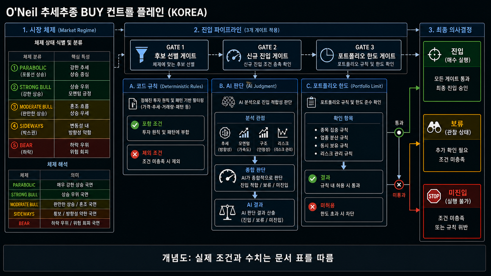

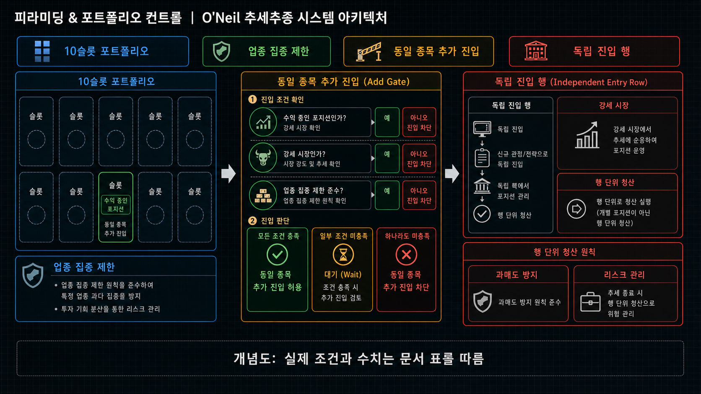

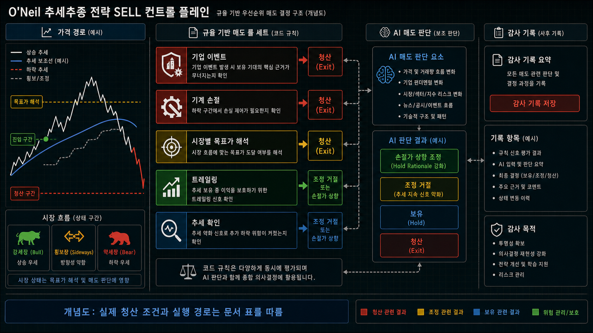

### 코드 기준 도식

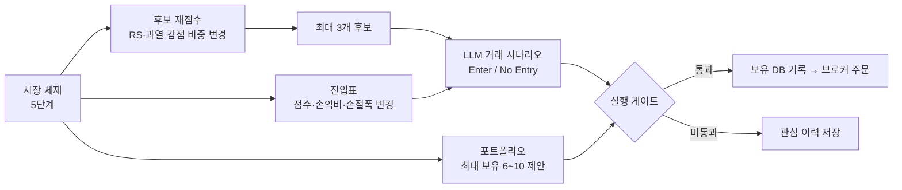

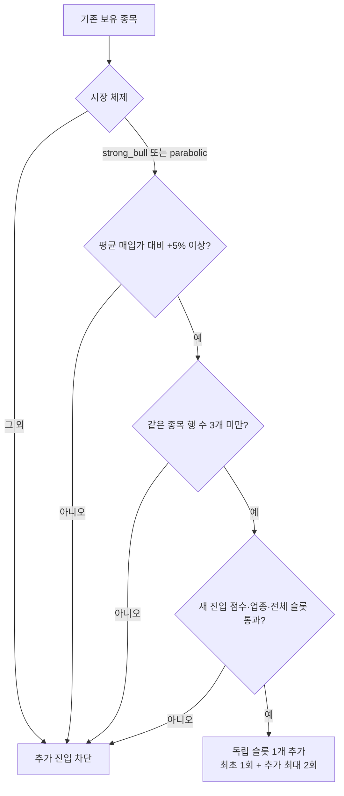

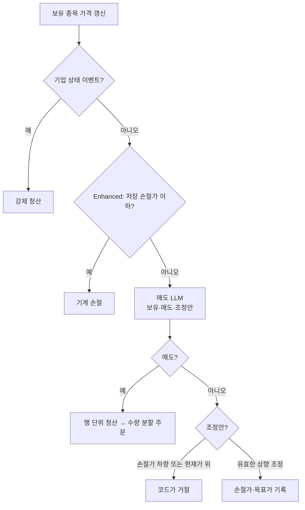

이 문서의 Mermaid 도식과 아래 표는 코드의 실제 기준값을 따른다.

핵심은 다음 네 문장이다.

1. 원본은 오닐식 성장주·모멘텀 추세추종을 기본 철학으로 둔다. 싼 주식을 오래 버티는 방식보다, 손실은 짧게 자르고 살아 있는 추세를 보유하려는 구조다.
2. 시황은 매수 금액을 연속적으로 바꾸기보다 후보 선별, 진입 문턱, 최대 슬롯, 같은 종목 추가 진입을 통해 노출을 조절한다.
3. LLM은 보고서·뉴스·수급·포트폴리오 문맥을 읽어 시나리오를 만들지만, 슬롯 한도·업종 집중·추가 진입·손절가 조정 범위에는 코드 규칙이 다시 개입한다.
4. `run_full_pipeline()`의 KR 실경로는 `EnhancedStockTrackingAgent`를 사용한다. 따라서 부모 클래스의 깔끔한 오닐 룰 엔진과, 실제 배치에서 강화 클래스가 LLM으로 처리하는 매도 경로를 구분해서 설명해야 한다.

## 1. 먼저 구분해야 하는 두 종류의 “시장 상태”

원본에는 비슷해 보이지만 용도가 다른 두 체계가 있다.

| 체계 | 상태 | 쓰는 곳 | 의미 |
|---|---|---|---|
| **5단계 시장 체제** | `parabolic`, `strong_bull`, `moderate_bull`, `sideways`, `moderate_bear`, `strong_bear` | 후보 재점수, 거래 시나리오, 슬롯, 피라미딩, 목표가 해석 | 종목을 새로 살 때 얼마나 공격적으로 볼지 |
| **Market Pulse** | `UPTREND`, `UNDER_PRESSURE`, `CORRECTION` | 배치 실행 시간 제어 | 시장이 나쁠 때 분석 배치 횟수를 줄일지 |

Market Pulse는 기본값이 `shadow`다. 즉 로그에는 판단이 남아도, 환경 설정을 `live`로 바꾸기 전에는 배치를 실제로 쉬게 하지 않는다. `CORRECTION`을 “전면 매수 금지”로 쓰는 것도 아니다. KR에서는 오전 배치를 쉬고 오후 종가 확인 배치는 남긴다. 기존 보유 종목의 매도 루프는 이 정책으로 멈추지 않는다.

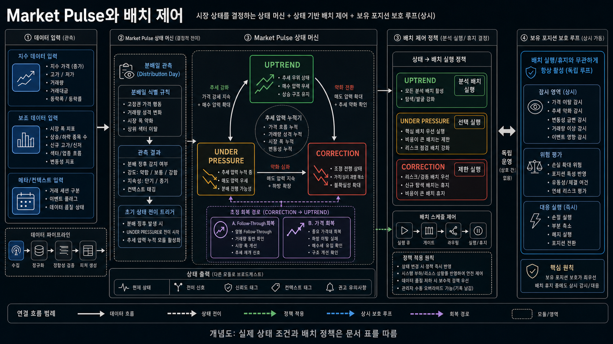

## 2. 시황이 후보 선별에 미치는 영향

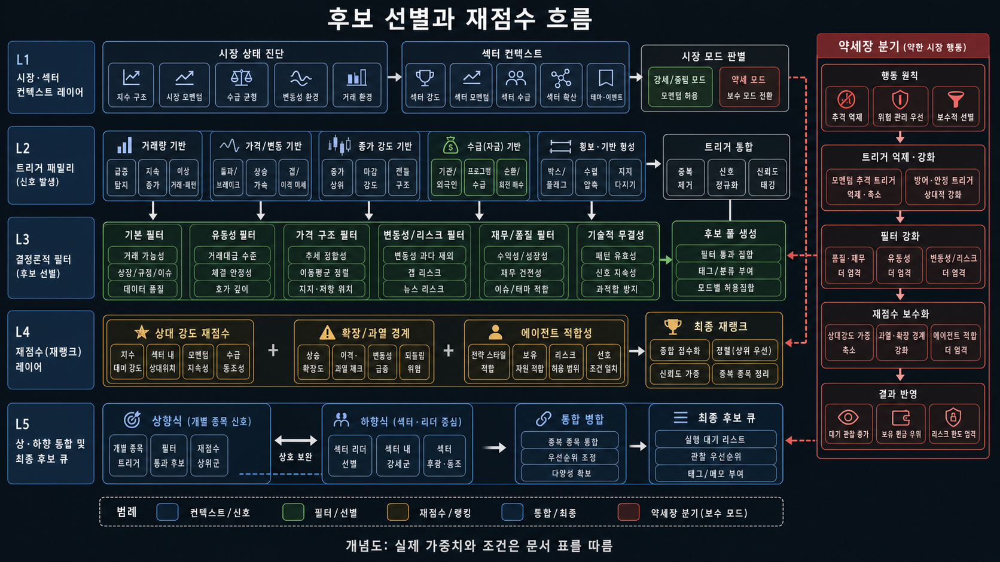

### 2.1 후보의 출발점

`trigger_batch.py`는 거래량 급증, 갭 상승, 상승률 상위, 마감 강도, 수급 등 여러 트리거에서 후보를 만든다. 이후 후보별로 다음 네 값을 섞어 순위를 다시 매긴다.

| 재점수 재료 | 뜻 | 강세장과 약세장에서의 차이 |
|---|---|---|
| 기본 복합 점수 | 가격·거래량 등 트리거의 원점수 | 모든 시장에서 출발점 |
| 에이전트 적합도 | 손익비와 손절가를 반영한 후보 품질 | 비중은 모든 시장에서 0.35 |
| RS 점수 | 시장 대비 상대강도 | `strong_bull`에서 0.30으로 가장 크게 봄 |
| 과열 감점 | 20일선 위로 ADR 몇 배나 벌어졌는지 | 횡보·약세에서 0.30~0.35로 더 크게 봄 |

실제 가중치는 다음과 같다. 네 값은 모두 0~1로 정규화되며 합도 1이다.

| 시장 체제 | 기본 점수 | 에이전트 적합도 | RS | 과열 감점 |
|---|---:|---:|---:|---:|
| `strong_bull` | 0.20 | 0.35 | 0.30 | 0.15 |
| `moderate_bull` | 0.25 | 0.35 | 0.20 | 0.20 |
| `sideways` | 0.20 | 0.35 | 0.15 | 0.30 |
| `moderate_bear` | 0.15 | 0.35 | 0.15 | 0.35 |
| `strong_bear` | 0.15 | 0.35 | 0.15 | 0.35 |

따라서 “강세장에서는 주도주를 더 빨리 찾고, 횡보·약세장에서는 이미 너무 오른 종목을 더 세게 경계한다”가 코드에 가까운 해석이다.

### 2.2 탑다운과 바텀업의 자리 배분

최종 후보는 최대 3개다. 탑다운은 시장이 주도 업종으로 분류한 후보, 바텀업은 개별 트리거에서 올라온 후보를 뜻한다.

| 시장 체제 | 탑다운 자리 | 바텀업 자리 | 현재 코드의 의도 |
|---|---:|---:|---|
| `strong_bull` | 2 | 1 | 주도 업종의 리더를 더 많이 반영 |
| `moderate_bull` | 1 | 2 | 업종과 개별 신호를 균형 있게 봄 |
| `sideways` | 1 | 2 | 과열 추격을 줄이고 개별 조건을 더 봄 |
| `moderate_bear` | 1 | 2 | 보수적 개별 선별 |
| `strong_bear` | 0 | 3 | 탑다운 추격을 끄고 바텀업 후보만 남김 |

단, 이 표는 **후보 3개를 채우는 규칙**이다. 계좌에 실제로 몇 종목을 보유할지는 뒤의 10슬롯·시장별 최대 보유 규칙이 결정한다.

## 3. 매수는 LLM 한 번의 “사라”가 아니다

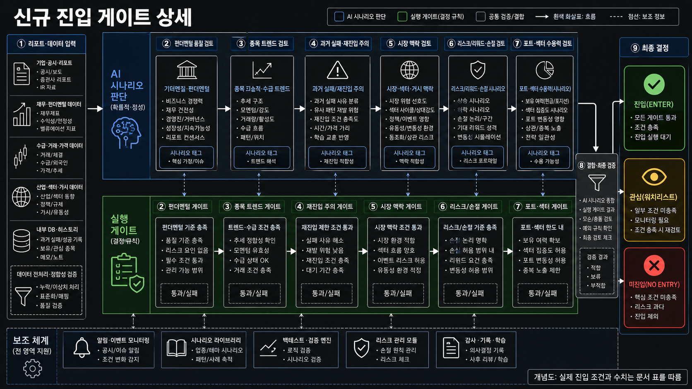

### 3.1 LLM 거래 시나리오가 보는 것

`trading_agents.py`의 매수 프롬프트는 CAN SLIM 관점으로 PDF 보고서를 읽고 JSON을 만든다. 입력에는 현재 보유 수, 업종 분포, 투자 기간 분포, 개별 종목 추세 팩트, 과거 매매일지 요약, 트리거 종류가 함께 들어간다.

LLM이 만들어야 하는 핵심 값은 다음과 같다.

- 펀더멘털 4개 통과 여부: 수익성, 재무건전성, 성장성, 사업 이해 가능성
- `buy_score`(1~10), `macro_adjustment`(-1/0/+1), `effective_score`
- 목표가, 손절가, 예상 손실과 손익비
- 시장 체제, 시장별 최소 점수, 최대 보유 슬롯
- `Enter` 또는 `No Entry`, 그리고 보유·매도 시나리오

### 3.2 LLM이 지켜야 하는 시장별 진입표

| 시장 체제 | 최소 유효 점수 | 최소 손익비 | 최대 손절폭 | 모멘텀 신호 | 추가 확인 |
|---|---:|---:|---:|---:|---:|
| `parabolic` | 4 | 0.7 | -7% | 1개 | 0개 |
| `strong_bull` | 4 | 1.0 | -7% | 1개 | 0개 |
| `moderate_bull` | 4 | 1.2 | -7% | 1개 | 0개 |
| `sideways` | 5 | 1.3 | -6% | 1개 | 0개 |
| `moderate_bear` | 5 | 1.5 | -5% | 2개 | 1개 |
| `strong_bear` | 6 | 1.8 | -5% | 2개 | 1개 |

`parabolic`은 아무 강세장에나 붙이지 않는다. 기본 체제가 `strong_bull`이고, KOSPI 90일 수익률 +30% 이상, 30일 수익률 +10% 이상, 특정 모멘텀 트리거라는 조건이 모두 맞아야 한다. 또한 최근 분산일이 높으면 **신규 매수에 한해** 한 단계 보수적으로 해석한다. 기존 보유분의 매도 규칙을 그 이유만으로 앞당기지는 않는다.

### 3.3 매수 전에 다시 걸리는 코드 게이트

LLM이 `Enter`를 내도 아래 중 하나에서 막히면 실제 진입하지 않는다.

1. 현재 보유가 10슬롯 이상
2. LLM이 준 `max_portfolio_size`(6~10) 이상
3. 같은 업종이 이미 3슬롯이거나, 보유 4개 이상에서 해당 업종 비율이 30% 이상
4. `buy_score < min_score`
5. 재진입 쿨다운이 `live`이고, 최근 손실·리스크 청산 후 금지 시간 안
6. 이미 들고 있는 종목인데 아래 피라미딩 추가 진입 게이트를 통과하지 못함

이 때문에 강의에서 “AI가 매수하라고 했는데 왜 실제 매수는 안 됐나요?”라는 질문에는, **AI의 시나리오와 실행 게이트는 별개**라고 답해야 한다.

## 4. 강세장에서 비중을 싣는 실제 방식: 피라미딩

### 4.1 현재 구현의 정확한 뜻

원본은 같은 종목을 물타기하지 않는다. 이미 수익 중인 종목에만, 같은 종목의 **독립 행을 하나 더 추가**하는 피라미딩이다.

| 추가 진입 허용 조건 | 실제 값 |
|---|---|
| 시장 체제 | `strong_bull` 또는 `parabolic` |
| 기존 포지션 성과 | 단순 평균 매입가 대비 현재가가 +5% 이상 |
| 같은 종목의 독립 진입 행 수 | 3개 미만, 즉 최초 1회 + 추가 2회까지 |
| 다른 매수 조건 | LLM의 `Enter`, 점수, 업종 분산, 포트폴리오 슬롯도 다시 통과 |

추가 진입은 10개 포트폴리오 중 한 슬롯을 추가로 쓴다. 그래서 “강세장에 비중을 싣는다”는 것은 현재 코드에서 **총 노출을 한 번에 늘리는 연속 비중 함수가 아니라, 수익 중인 리더에게 최대 두 개의 같은 크기 슬롯을 더 주는 구조**다.

### 4.2 절제하는 장치

- 약세·횡보에서는 같은 종목 추가 진입을 원천 차단한다.
- 손실 중이거나 +5%에 못 미치면 차단한다.
- 3행이 되면 차단한다.
- 전체 10슬롯과 시장별 최대 보유 한도를 넘으면 차단한다.
- 업종 집중 제한도 그대로 적용한다.

즉 “강세장에서 집중”과 “아무 종목이나 몰아 사기”는 다르다. 수익 중인 리더, 강한 시장, 남은 슬롯, 업종 한도라는 네 겹의 제한이 있다.

### 4.3 청산 때 과매도를 막는 방식

같은 종목을 3행으로 들고 있으면 각 행은 매수 시점·손절가·시나리오가 다를 수 있다. 한 행의 매도 신호가 나면 DB에서 그 행만 지우고, 브로커의 총 보유 수량을 남은 행 수로 나눠 해당 몫만 주문한다. 같은 실행 주기에 여러 행이 팔릴 때는 최초 수량을 한 번만 읽고 누적 주문량을 빼서 계산한다. 체결이 늦어도 같은 수량을 중복으로 팔지 않으려는 장치다.

### 4.4 중요한 한계: ATR 금액 비중은 아직 아니다

현재 KIS 주문 수량은 원칙적으로 `종목당 고정 매수금액 ÷ 현재가`로 계산한다. 손절폭·ATR·계좌 위험률에 따라 “변동성이 큰 종목은 적게 산다”처럼 연속적으로 수량을 조절하지 않는다.

따라서 구독자가 말한 “터틀 + ATR + 시황 비중”을 강의 예시로 만들 때는 다음을 분리해서 설명해야 한다.

| 현재 원본에 있음 | 추가해야 하는 것 |
|---|---|
| 추세·시장 체제·슬롯·추가 진입·손절가 | ATR 계산 |
| 강세장 피라미딩, 약세장 진입 문턱 강화 | 계좌 위험률 기반 주문 수량 |
| 업종 한도·최대 슬롯 | 종목별 최대 손실과 총위험 한도 |

## 5. 매도: 실제 배치와 부모 오닐 엔진을 분리해서 보기

### 5.1 `run_full_pipeline()`이 실제로 타는 Enhanced 경로

오케스트레이터는 `EnhancedStockTrackingAgent`를 만든다. 이 클래스는 부모의 `_analyze_sell_decision()`을 덮어쓴다.

실제 Enhanced 경로의 순서는 다음과 같다.

1. 관리종목 등 기업 상태를 확인한다. 명백한 이벤트면 AI 전에 강제 청산한다.
2. 저장된 손절가 이하이면 AI 전에 기계적으로 청산한다.
3. 진입 후 최고가를 갱신하고, 보유 수·업종 분포·이전 손절/목표가 조정 이력을 만든다.
4. 매도 LLM이 최신 데이터와 포트폴리오 문맥을 읽어 `should_sell`, 근거, 목표가·손절가 조정안을 낸다.
5. 보유 판단에서만 조정안을 반영한다. 손절가를 내리거나 현재가보다 높은 손절가를 제안하면 코드가 거절한다. 즉 손절가는 한 방향으로만 위로 조인다.
6. LLM 응답이 비었거나 JSON 파싱에 실패하면 강화 클래스의 레거시 매도 규칙으로 폴백한다.

이 경로는 빠른 손절을 우선한다. 프롬프트가 종가 기준 손절을 말해도, Enhanced 코드에는 현재 조회가가 저장 손절가 이하이면 바로 파는 규칙이 있어 설명을 섞으면 안 된다.

### 5.2 부모 `StockTrackingAgent`의 오닐 룰 엔진

부모 클래스에는 더 명시적인 `cores/oneil_fallback.py`가 있다. 이 엔진은 `Enhanced`가 아닌 부모 경로에서 우선 사용된다.

| 우선순위 | 규칙 | 결과 |
|---:|---|---|
| 0 | 기업 이벤트 | 즉시 청산 |
| 1 | 시나리오 손절가를 0.5% 완충까지 뚫음, 또는 진입가 대비 -7% | 즉시 청산 |
| 1.5 | 손실 상태에서 50일선도 0.5% 이상 이탈 | 청산 |
| 2 | 진입 뒤 +5% 이상 오른 뒤 트레일링 선 이탈 | 청산 |
| 3 | 목표가 도달 | 강세면 보유, 횡보·약세면 전량 청산 |
| 기본 | 위 조건 없음 | 보유 |

트레일링 폭은 매도 시점에 다시 계산한 현재 시장 체제를 쓴다.

- `parabolic`·강세: 고점 대비 -8%
- 횡보·약세: 고점 대비 -5%
- 현재 체제를 못 가져온 경우: -10%로 보수적으로 폴백

여기서 목표가는 강세장에선 “수익 실현 명령”보다 “승자를 계속 보유하되 트레일링으로 보호할 이정표”다. 이것이 오닐식 “손실은 짧게, 승자는 길게”의 구현이다.

### 5.3 매도 LLM 프롬프트가 요구하는 것

`create_sell_decision_agent()`는 다음을 명시한다.

- 분할 매도·물타기 금지. 한 행은 전량 보유 또는 전량 청산.
- 손절과 트레일링은 종가 기준 취지이며, 장중 일시 이탈만으로 팔지 않음.
- 목표가 도달은 강세에선 트레일링 전환, 약세에선 전량 청산.
- 트레일링은 진입 후 최고가가 +5%에 도달한 다음에만 활성화.
- 시간 경과는 자동 매도 조건이 아니라 추세를 다시 볼 시점.
- 기업 이벤트, 추세 훼손, 수급 악화, 뉴스·공시 위험을 종합해 판단.

프롬프트는 “전략의 의도”이고, 실제 Enhanced 코드의 빠른 기계 손절·조정 거절은 “실행 안전장치”다. 강의에서는 둘 중 하나만 말하면 오해가 생긴다.

## 6. AI와 결정론적 코드의 역할 경계

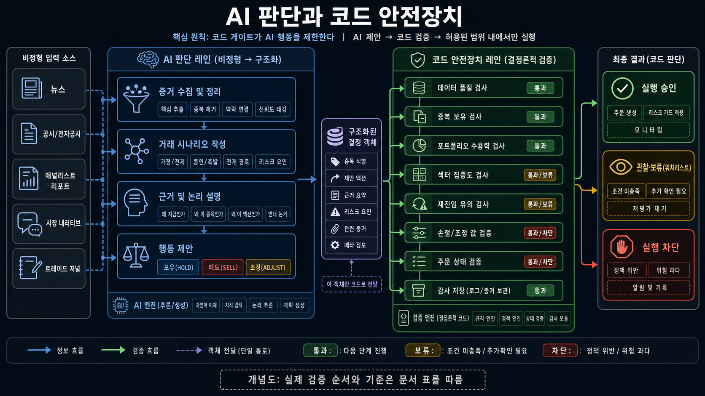

| 항목 | AI가 하는 일 | 코드가 강제하는 일 |
|---|---|---|
| 시장 해석 | 뉴스·업종·거시 맥락 요약 | 지수·분산일·이동평균 등 수치 계산 |
| 새 진입 | 펀더멘털·모멘텀·손익비를 묶어 시나리오 작성 | 최소 점수, 최대 슬롯, 업종 한도, 재진입 제한 검사 |
| 비중 확대 | 시장 체제와 종목 상태를 설명 | 강세/포물선, +5%, 3행 미만일 때만 추가 진입 |
| 손절·목표가 | 가격 수준과 근거 제안 | 손절가 하향 금지, 현재가 위 손절가 거절, 기계 손절 |
| 매도 | 뉴스·공시·수급·추세를 종합 판단 | 기업 이벤트 강제 청산, 행별 수량 분할, 중복 매도 방지 |

이 경계가 구독자가 말한 “정형화 안 되는 것은 AI가 휴리스틱하게 판단”을 안전하게 바꾸는 방식이다. AI는 근거를 모아 판단을 보태고, 돈이 나가는 경로는 숫자 한도와 상태 전이로 다시 잠근다.

### 피드백·재진입 제한은 강화학습이 아니다

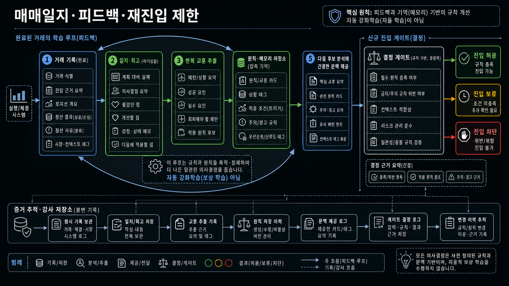

매도 결과와 일지에서 반복 교훈을 뽑아 다음 후보의 참고 문맥과 점수 조정 제안으로 쓰는 구조다. 이 과정은 스스로 보상 함수를 바꾸며 정책을 학습하는 강화학습이 아니다. 재진입 제한도 최근 매도 이력과 위험 청산 여부를 확인하는 결정론적 게이트다.

## 7. 강의에서 바로 설명할 수 있는 예시

### 강세장에서 비중을 싣는 경우

1. 시장 체제가 `strong_bull`이다.
2. A 종목 첫 진입 뒤 현재가가 평균 매입가보다 +5% 이상이다.
3. A 종목의 독립 행이 1개 또는 2개다.
4. 새 보고서도 `Enter`, 점수·업종·슬롯 한도를 통과한다.
5. 그러면 A에 한 슬롯을 더 준다. 세 번째 행까지 가능하다.

### 장이 나빠 절제하는 경우

1. `moderate_bear` 또는 `strong_bear`라면 신규 진입은 더 높은 점수, 더 높은 손익비, 더 타이트한 손절폭, 더 많은 모멘텀·추가 확인을 요구한다.
2. 같은 종목 추가 진입은 허용되지 않는다.
3. 후보 재점수에서 과열 감점의 비중이 커진다.
4. Market Pulse가 실제 `live`고 `CORRECTION`이면 KR 오전 분석 배치도 쉰다. 단, 보유분 매도는 계속 본다.

### 터틀 + ATR로 확장하는 순서

1. 터틀 돌파 조건을 후보 선별 또는 진입 게이트로 만든다.
2. ATR 기반 손절가를 만든다.
3. `계좌당 허용 손실 ÷ (진입가 - ATR 손절가)`로 주문 수량을 계산하도록 고정 금액 주문부를 바꾼다.
4. 지금의 시장별 슬롯·피라미딩·업종 한도를 유지하거나, 총위험 한도를 추가한다.
5. 뉴스·공시·유료 리포트는 별도 입력 경로에서 확인된 구조화 요약으로 만든 뒤 AI 판단에 넣는다.

## 8. 코드 위치

| 관심사 | 원본 코드 |
|---|---|
| 시장 체제·매수 시나리오·매도 프롬프트 | `cores/agents/trading_agents.py` |
| 후보 재점수·탑다운/바텀업 자리 | `trigger_batch.py` |
| Market Pulse 상태 기계 | `cores/market_pulse.py` |
| Correction 배치 휴식 정책 | `cores/regime_policy.py` |
| 실제 파이프라인에서 쓰는 강화 추적 | `stock_tracking_enhanced_agent.py` |
| 부모의 매수·슬롯·주문·매도 루프 | `stock_tracking_agent.py` |
| 같은 종목 추가 진입·행별 매도 수량 | `tracking/helpers.py` |
| 명시적 오닐 매도 룰 엔진 | `cores/oneil_fallback.py` |
| 실제 KR 실행 연결 | `stock_analysis_orchestrator.py` |

## 9. 설명할 때 반드시 붙일 주의 문장

- “10슬롯”은 포트폴리오 관리 단위이지, 계좌 전체 자산을 정확히 10등분한다는 보장은 아니다.
- “비중 확대”는 현재는 동일 종목 독립 슬롯 추가다. ATR·계좌 위험률 기반 연속 수량 조절은 별도 구현이다.
- “오닐 매도”는 부모 클래스에 명확히 있으나, 전체 파이프라인은 Enhanced 매도 경로를 사용한다. 두 경로의 종가 기준·즉시 손절 차이를 숨기면 안 된다.
- DB 보유 기록이 주문보다 먼저 바뀌는 경로가 있으므로, 분석 신호·DB상 주문·브로커 체결을 서로 다른 상태로 모니터링해야 한다.

## 10. 근거 코드 빠른 찾기

| 확인한 내용 | 원본 위치 |
|---|---|
| 5단계 진입표, 포물선장 조건, 분산일 신규 매수 방어 | `cores/agents/trading_agents.py:113-162` |
| 펀더멘털·추세 게이트, 반복 손절 게이트 | `cores/agents/trading_agents.py:93-111` |
| 후보 재점수 가중치 | `trigger_batch.py:395-402` |
| 탑다운·바텀업 자리 배분 | `trigger_batch.py:1222-1241` |
| 피라미딩 조건과 행 수 제한 | `tracking/helpers.py:242-366` |
| 업종 절대·비율 제한 | `tracking/helpers.py:397-450` |
| 부모 오닐 매도 우선순위 | `cores/oneil_fallback.py:76-131` |
| Enhanced의 기계 손절 후 LLM 매도 | `stock_tracking_enhanced_agent.py:807-1114` |
| Enhanced의 손절가 상향 전용 래칫 | `stock_tracking_enhanced_agent.py:1281-1323` |
| 전체 파이프라인이 Enhanced를 생성 | `stock_analysis_orchestrator.py:1134-1161` |
